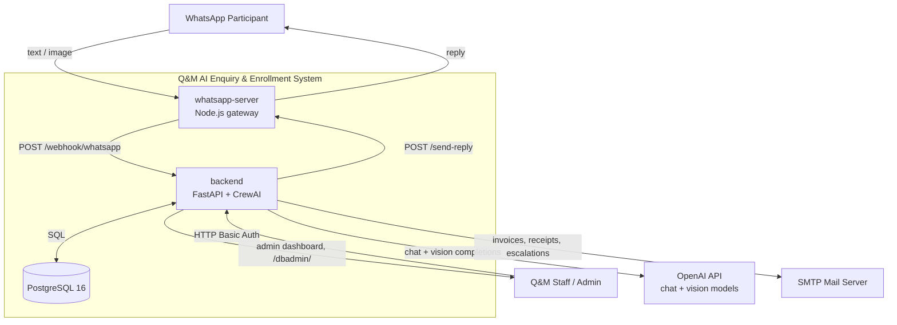
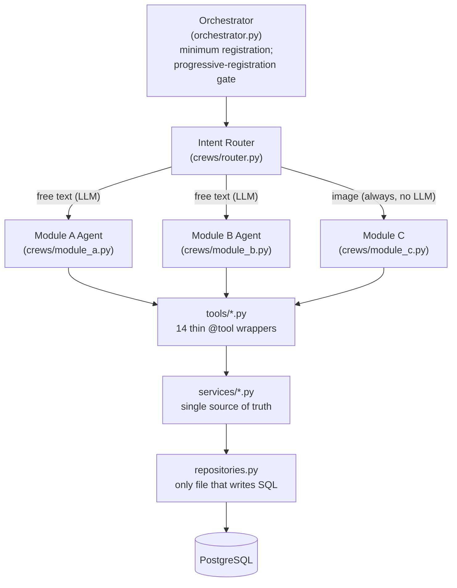
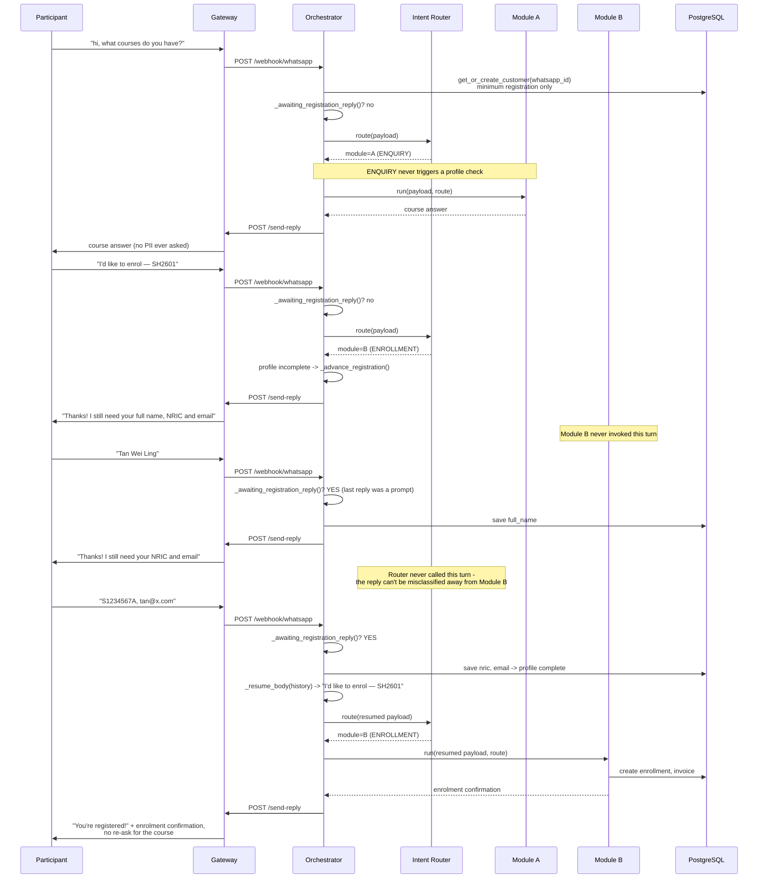
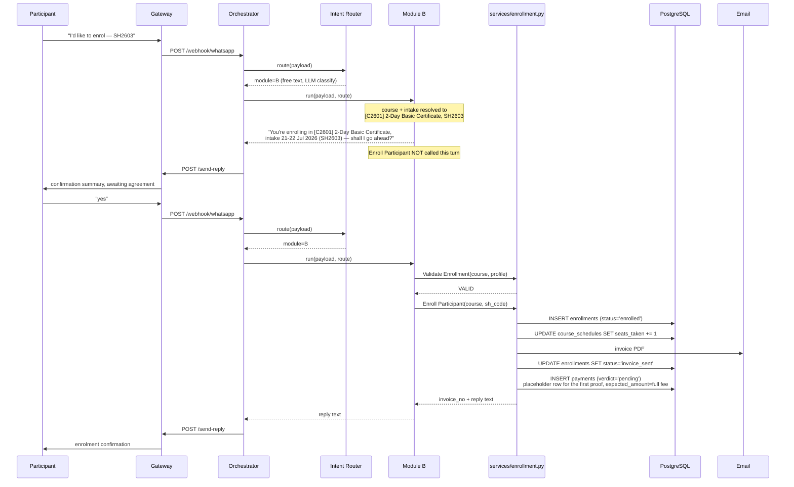
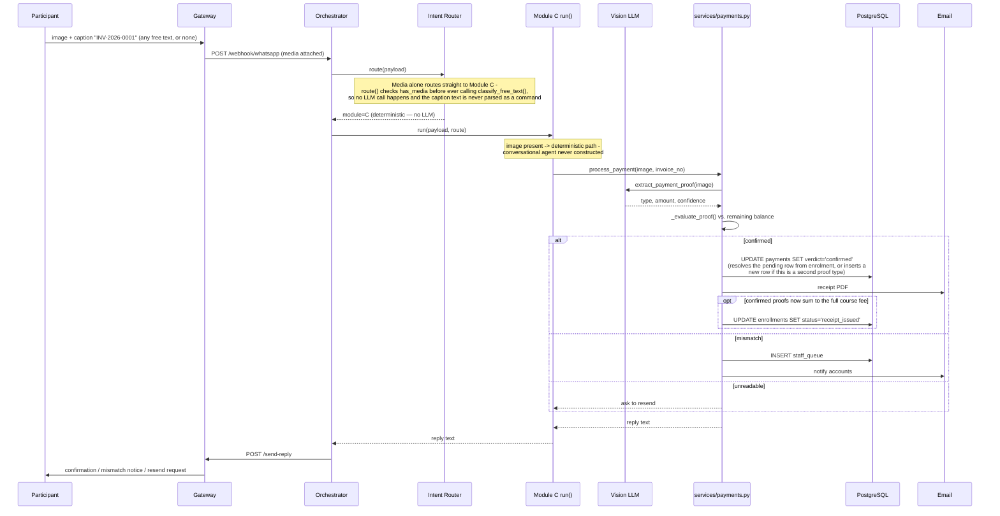

# Design Document — Q&M AI-Powered Enquiry & Enrollment System

## Document Information

- **Feature Name**: Q&M AI-Powered Enquiry & Enrollment System (WhatsApp Agentic Backend)
- **Version**: 1.30
- **Date**: 2026-08-25
- **Author**: Q&M / WA_CrewAI project team
- **Reviewers**: Q&M training operations lead, backend engineering, accounts/finance stakeholder
- **Related Documents**: [sdd/requirement_qm.md](requirement_qm.md), [README.md](../README.md), [docs/architecture_agentic_ai.html](../docs/architecture_agentic_ai.html), [docs/ROUTER_REDESIGN.md](../docs/ROUTER_REDESIGN.md)

## Version History

### v1.30 — 2026-08-25 (implementation complete)
Carries forward `requirement_qm.md` v1.30 (Requirement 4 AC2, strengthened). Found while stress-testing v1.29's fix more broadly (not the originally reported bug) — see Component 7 for the mechanism.

### v1.29 — 2026-08-25 (implementation complete)
Carries forward `requirement_qm.md` v1.29 (Requirement 3 AC5, Requirement 4 AC15, both strengthened). Fixes a genuine data-loss bug reported live and confirmed via a direct database check: an already-completed, correctly-saved reminder was silently reverted and deleted by Module A's own ambiguity backstop, triggered by a later, unrelated enrolment attempt. Explicitly investigated whether this was a regression from the v1.26–v1.28 router redesign before fixing anything — it was not: both root causes (Component 3's enrolment-keyword list, Component 4's reminder-ambiguity backstop) predate Task 44 by several sessions; `conversation_state`/Tier 0 only ever recorded what these two, independently-buggy mechanisms concluded. See Components 3 and 4 below for the mechanism and live verification.

### v1.28 — 2026-08-23 (implementation complete)
Carries forward `requirement_qm.md` v1.28 — `ROUTER_REDESIGN.md` Phases 3–5, planned via an explicit plan-mode review with the user before implementation (per their own standing instruction not to change the already-working Task 44/45 sticky-routing code unnecessarily), with two deliberate scope decisions confirmed with them up front:
- **Phase 3's "retire the two existing regex overrides" was NOT done** — Task 45's audit found `_has_explicit_enrollment_signal`/`_looks_like_payment_intent` exemptions on the reminder-in-progress override, and the bare-confirmation downgrade, both still resolve real cases with no `conversation_state` yet to consult (a flow's first turn). Confidence-gating (Component 3) is additive on top of them.
- **Phase 4's reroute contract is scoped to Module C only** (Component 6) — the concrete gap the doc names (zero delegation coworkers); Module A/B keep their existing, working delegation mechanism (Requirement 12) instead of a second, parallel one.

See each affected component's Implementation Notes below for the concrete mechanism and live-verification record. Summary: Component 3 gains confidence-gated classification with a disambiguation-menu fallback (Requirement 3 AC13); Component 6 gains a reroute-back-to-router escape hatch (Requirement 3 AC14); Component 5 gains conversational cancellation (Requirement 11 AC5); Component 10 gains a reminder-dispatch cron job (Requirement 10 AC5 — reminders were being saved but never actually sent, a gap found during the original `ROUTER_REDESIGN.md` review) and decouples credit-note PDF/email delivery from the synchronous staff-approval action (Requirement 11 AC3, strengthened).

### v1.27 — 2026-08-23 (implementation complete)
Carries forward `requirement_qm.md` v1.27 (Requirement 3 AC7 strengthened). A requested edge-case audit of v1.26's sticky routing — Module A/Module B routing re-verified correct, a fresh no-image payment query re-verified reaching Module C, plus a check of `ROUTER_REDESIGN.md` for other suggested improvements — surfaced one genuine bug, distinct from Tier 0 itself: `router.py`'s pre-existing `_reminder_in_progress` override (Component 3, predates v1.26) forces ENQUIRY whenever a reminder is in play, exempting only an explicit enrollment signal, never a payment one. A payment claim arriving while a reminder flow was sticky ("I already paid for my other course, can you check") was forced back to Module A instead of Module C — verified live, in both `_heuristic()` and the post-LLM cross-check in `classify_free_text()`.

Before fixing, the naive mirror-the-enrollment-exemption approach was checked against a risk `ROUTER_REDESIGN.md` itself explicitly flags — a reminder flow's own email-continuation reply must not fall through to Module C on keyword match — and confirmed live to be real: `pay@mycompany.com` (a plain answer to the reminder's email-ask) contains "pay" as a whole word and would wrongly flip to Module C under a blanket exemption. New `_looks_like_payment_intent()` (single canonical check, replacing every direct `_PAYMENT_KEYWORD_RE.search()` against a participant's own message) is guarded by `_BARE_EMAIL_RE`: a message that is ENTIRELY just an email address never counts as payment intent, regardless of its address's contents; combined with other text, a payment claim is unaffected. Verified live: the genuine payment-mid-reminder case now reaches Module C with a sensible reply; the bare-email-continuation case (the doc's own flagged risk) stays correctly routed to Module A; the original v1.26 "how to pay the course" fix re-verified unaffected.

Full edge-case battery run (see `task_qm.md` v1.27 for the complete list) also confirmed, with no code change needed: the fee-amount-vs-payment-submission boundary ("how much do I need to pay for course 1" correctly stays ENQUIRY — the LLM's widened PAYMENT definition, v1.26, isn't over-broad), an explicit enrollment signal correctly breaks out of a sticky reminder flow, an image attachment always routes to Module C regardless of any sticky state (Requirement 3 AC2 holds under Tier 0), and Module B's sticky state already correctly yields to a payment query (no equivalent bug on that side, since Module B has no analogous blanket Tier-1 override).

`ROUTER_REDESIGN.md`'s remaining items (Phase 3 confidence-gated classification and retiring the AC5/AC7/AC8 regex overrides, Phase 4's reroute contract, Phase 5's cancellation/reminder-dispatch/credit-note-fan-out, and the module_a.py/module_b.py prompt-dedup) were reviewed and reported back but deliberately left out of scope for this pass, pending explicit direction.

### v1.26 — 2026-08-23 (implementation complete — Phase 1+2 of a larger proposal)
Carries forward `requirement_qm.md` v1.26 (Requirement 3 AC10–AC12). Component 3 (Intent Router) gains a **Tier 0 sticky-dispatch check**, run before the existing Tier 1 classification (Router Agent + `_heuristic()` + the AC5/AC7/AC8 keyword overrides, all unchanged): a new `conversation_state` table records which module and flow a participant is mid-conversation with, written by Component 4 (Module A) and Component 5 (Module B) at the exact points each already knows its own reply left something open, and read deterministically by the Router before it re-derives intent from text.

This directly fixes the reported routing bug (a fully-registered participant replying "intake 1" to Module B's own just-shown intake list got diverted to Module A instead, because a 2-turn text window happened to still contain the word "remind" from an unrelated, already-resolved reminder two turns earlier) and replaces the *class* of bug the last several versions' point-patches (AC5, AC7, AC8 and their v1.16/v1.18/v1.19/v1.20/v1.22 revisions) were separately chasing — but it does not remove those checks; they remain as the Tier 1 fallback for a participant who isn't currently mid-flow.

This is Phase 1+2 of a larger 5-phase proposal the user reviewed (companion note: `ROUTER_REDESIGN.md`, shared in chat): confidence-gated Tier 1 classification and retiring the AC5/AC7/AC8 regex overrides (Phase 3), a structured reroute contract letting a module hand a wrong turn back instead of answering outside its lane (Phase 4), and a conversational cancellation flow plus automated reminder-dispatch/credit-note background workers (Phase 5) were all explicitly deferred, not part of this revision.

- **Component 3 (Intent Router)**: new Tier 0 `_sticky_dispatch()`, described below.
- **Component 4 (Module A)**: writes/clears `conversation_state` at its existing reminder-pending decision points — no change to the reminder-detection or directive logic itself.
- **Component 5 (Module B)**: writes/clears `conversation_state` at its existing intake-list and confirmation-marker decision points — no change to the enrollment logic itself.
- See `task_qm.md` v1.26 for the implementation record.

### v1.25 — 2026-08-23 (implementation complete)
Carries forward `requirement_qm.md` v1.25 — a course-ambiguity guard for the reminder flow (Requirement 4 AC15), covering both the bot-offered path and a participant-initiated reminder request. No schema change (reuses the `reminders` table from v1.22). Implementing it surfaced that the reminder mechanism's core "is a reminder pending" and "what's the recent course context" checks (Component 4) had both been scoped to a narrow, assistant-turns-only window that structurally could not see a participant-initiated request (the anchor word only ever appeared in the PARTICIPANT's own message) — widened to also scan the participant's new message and, for course-ambiguity specifically, the full recent conversation (both roles). Also reconfirmed, a third time this session, that prompt-only compliance with an explicit "don't do X yet" instruction is unreliable for this agent/model combination: the conversational agent was observed naming a course before asking for email despite a directive forbidding it, requiring the same deterministic-backstop treatment (Component 4) already applied to the intake-date ask in v1.21. `router.py`'s two separate reminder-continuation checks (Component 3) were consolidated into one, delegating to Module A's own detection, once the same narrow-window gap was found duplicated there independently. See Component 3 and Component 4's implementation notes. Verified live end-to-end: a two-course conversation, an unprompted reminder request, deterministic email-ask, "which course?" ask (paraphrased answer resolved via a new word-overlap match), "which intake?" ask, correct save — plus every previously-passing reminder and enrolment scenario re-verified unaffected.

### v1.24 — 2026-08-23 (decision recorded, no code change)
Explicit architectural question, asked in service of a stated future goal: a scheduled reminder-sending agent (Requirement 10) should be able to "run the list" of who to email. The question was whether that list should live inside the legacy `leads` table rather than the standalone `reminders` table (v1.22). Investigated before deciding, per instruction: `leads.phone`/`leads.whatsapp_id` are both `UNIQUE NOT NULL`/`UNIQUE` — the table is structurally one-row-per-participant. Three existing paths depend on that: `orchestrator.py`'s registration sync (`register_customer()`), `services/enrollment.py`'s `get_lead(phone)` → `set_lead_status(phone, "enrolled")` (a bare phone-keyed UPDATE that would mark every row for that phone "enrolled," including unrelated pending reminders, if the table held more than one row per phone), and `leads` mixing participant-level fields (name, NRIC, DOB — one true value per person) with course-interest fields (preferred_course, course_date — legitimately many per person) in a single row. Separately, `leads` is already deprecated in favour of `customers` (CLAUDE.md), and the codebase's own existing scheduled-outreach feature (`scheduler.py: run_followups()`) already abandoned `leads` for a dedicated query (`customers_due_for_followup()`) rather than reading it. Presented these findings; decided to keep `reminders` as its own table — the same pattern already proven for scheduled follow-ups, with no schema risk to the enrollment-status sync. No code changed; `reminders` (v1.22) already matches this decision.

### v1.23 — 2026-08-23 (implementation complete)
Carries forward `requirement_qm.md` v1.23. `admin.py`'s dashboard gained a "Reminders" table (new `repositories.all_reminders()` + `/admin/reminders`) listing every saved reminder across all participants. The trigger was a re-report of v1.22's own already-verified scenario as "overwritten" — a direct `SELECT` against `reminders` for the exact participant in question showed two correct, independent rows, matching the query log; the gap was that nothing in `/admin/` could show this, only raw SQL or `/dbadmin/reminders` could. See Component (admin dashboard, `backend/app/admin.py`) — the same participant legitimately appearing more than once in this table is the intended behaviour, not an error state, called out directly in the page's own heading.

### v1.22 — 2026-08-23 (implementation complete)
Carries forward `requirement_qm.md` v1.22 — multi-instance reminder storage (Requirement 4 AC14), correcting an earlier same-session assessment that treated the underlying single-slot limitation as accepted, out-of-scope behaviour rather than a real gap. New `reminders` table (Component 2/4/repositories), independent of `customers.preferred_course`/`course_date`, which continue to track only "what's currently being discussed." Implementing it surfaced three further gaps in the same area: (1) a reply naming only a course had no deterministic routing anchor — merged into Component 3's now-single reminder-reply override (Requirement 3 AC7/AC9), replacing the last two shape-specific special cases with one shape-independent rule; (2) a course change with no accompanying date left a stale date from a different course attached to the new one — fixed with a new `update_customer_course_interest()` that clears it; (3) the agent was observed live pairing a real intake date with the wrong course in its own tool call — closed with a direct correctness check (does the saved date match one of the actual course's real intake labels?) that reverts both the customer record and any already-created reminder row when it doesn't. See Components 2, 3, and 4's implementation notes. Verified live: two independent reminders for the same participant (different courses, different dates) both persist correctly with no cross-contamination; re-affirming an already-saved reminder does not duplicate it; every previously-passing reminder and enrolment scenario (including the numbered-intake-list path) re-verified unaffected.

### v1.21 — 2026-08-23 (implementation complete)
Carries forward `requirement_qm.md` v1.21 — a simplification, made in response to explicit feedback that the reminder mechanism (Requirement 4 AC13, built up across v1.18–v1.20) had accumulated too many separately-reasoned special cases. The immediate trigger was a reply naming the wrong course's intake dates, caused by two mechanisms independently guessing "which course" from different, sometimes-disagreeing sources — but rather than add a third mechanism to reconcile them, the pre-agent guess was removed outright. See Component 4's implementation notes for the full before/after. Net effect: `_reminder_directive()` no longer computes or embeds course/schedule information at all in its "known email" branch (down to a single generic instruction), its return type simplified back to a plain string, and two now-fully-unused helper constructs (`_still_asking_for_email()`, `_ASKING_FOR_EMAIL_RE`/`_HAS_SAVED_EMAIL_RE`, and the dead `_REMINDER_MARKERS` tuple) were deleted rather than left as unused surface area. Verified live: the exact reported inconsistency (course drift via a briefly-mentioned-then-abandoned course) no longer occurs — the reply's course and dates always match what was actually saved; every previously-passing reminder and enrolment scenario re-verified unaffected, including the numbered-intake-list enrolment path fixed in v1.20.

### v1.20 — 2026-08-23 (implementation complete)
Carries forward `requirement_qm.md` v1.20 — a critical regression from v1.18's `_pending_reminder_intake_ask()` (Requirement 3 AC9): checking for the word "intake" alone in recent conversation also matched Module B's own enrolment intake question, hijacking a genuine "intake 1" reply away from Module B (which has the only tools that can actually create an enrolment) before it was ever reached, silently breaking the entire enrolment path for any participant who reached Module B's numbered intake list. See Component 3's implementation notes. Verified live: the exact regression scenario (registration → numbered intake list → "intake 1" → confirm) now completes and invoices correctly; a second enrolment for the same participant (multi-course) verified independently persisted; the original reminder-flow intake-ask case this check exists for re-verified still routing and saving correctly.

### v1.19 — 2026-08-23 (implementation complete)
Carries forward `requirement_qm.md` v1.19. A single reported symptom (a second reminder request, for a different course, silently never saved) root-caused via the live query log to four independent, compounding gaps across the router and Module A — none of them the database restriction the report suspected. See Components 3 and 4's implementation notes for the full chain: (1) the reminder-intent keyword regex (v1.17) didn't match "remindered"; (2) an explicit course reference resolved to the wrong (most-recently-discussed) course, compounded by a same-turn staleness bug in the orchestrator's deterministic course-interest capture; (3) the reminder-pending detector (v1.18) required "email" to co-occur with "remind," which doesn't hold for a second reminder once the email is already on file; (4) a date-matching heuristic treated any two same-year intakes as ambiguous, and the agent was separately found consistently inventing a default intake rather than asking. Verified live: the exact reported flow (first reminder complete, second reminder for an explicitly different course) now resolves the correct course throughout and persists all fields correctly on both the `customers` and legacy `leads` tables (confirmed by direct read, in place — not duplicated); every previously-passing case (decline, normal enrolment, already-registered participant) re-verified unaffected.

### v1.18 — 2026-08-22 (implementation complete)
Carries forward `requirement_qm.md` v1.18. Three fixes, the last two found while implementing the first: (1) the reminder-context detection window needed to span the last two assistant turns, not one, when the offer/email-ask split across separate turns; (2) a reminder had no way to enforce a specific intake before being considered saved, and `customers` turned out to have no `course_date` column at all to persist one to; (3) the fabrication guard (v1.14) was found, live, to falsely block a genuine, successfully invoiced enrollment reached via delegation — a ContextVar flag it depended on didn't reliably propagate out of a tool call inside a multi-agent crew, so it was replaced with a fresh-database-read comparison. See Components 3 and 4's implementation notes. Verified live end-to-end: the exact reported "Three Xin" transcript now saves correctly; a full reminder flow (offer → email → intake question → intake chosen) persists all three fields and is independently confirmed via direct DB read; a full normal enrollment (registration → intake selection → confirm) now completes and reports success correctly, where it previously reported a false "not enrolled" denial.

### v1.17 — 2026-08-22 (implementation complete)
Carries forward `requirement_qm.md` v1.17: a participant's own fresh, unprompted statement of reminder intent (not a reply to an existing offer) had no deterministic anchor to ENQUIRY and could be misclassified ENROLLMENT by the LLM, tripping the registration gate on what was actually a reminder request. See Component 3's implementation notes. Verified live against the exact reported trigger, a compound enrol+remind message (enrollment correctly still wins), and the pre-existing reply-to-offer reminder flow (unaffected).

### v1.16 — 2026-08-22 (implementation complete)
Carries forward `requirement_qm.md` v1.16: fixes two regressions from v1.15, both found on live re-test — a false NRIC-near-miss hint on the ordinary word "MENTIONED", and the fuzzy reminder-context check still failing when "remind" and "email" legitimately land in separate sentences. See Component 2's implementation notes. Verified live against both exact reported triggers, and re-verified every previously-passing case (genuine NRIC typo, genuine reminder flow, normal enrolment) to confirm nothing else regressed.

### v1.15 — 2026-08-22 (implementation complete)
Carries forward `requirement_qm.md` v1.15: closes a fourth recurrence of the name-corruption bug (ambiguous "I am"/"I'm" cue) and replaces exact-marker reminder-state detection with a fuzzy keyword-proximity check, after exact-marker reproduction failed a third distinct way (paraphrasing, following an earlier casing failure). See Component 2's implementation notes. Verified live end-to-end against the exact reported transcript for both bugs; re-verified unaffected: a genuine "I am [Name]" self-introduction (now via the LLM path), and a plain registration prompt correctly not triggering a false reminder-context match.

### v1.14 — 2026-08-22 (implementation complete)
Carries forward `requirement_qm.md` v1.14 — the most severe bug fixed this session: Module A fabricating a complete enrollment confirmation with no enrollment ever created, traced back to a silently-abandoned registration flow caused by an unacknowledged NRIC typo. See Components 2 and 4 for the full chain and the structural fix. Verified live end-to-end: the near-miss NRIC now gets specific feedback and keeps the flow open; the corrected NRIC then resumes registration correctly; the exact reported fabrication trigger now produces an honest reply; multiple follow-up attempts to reproduce a fresh fabrication found none, with the guard correctly silent throughout. Normal registration and enrollment flows re-verified unaffected.

### v1.13 — 2026-08-22 (implementation complete)
Carries forward `requirement_qm.md` v1.13: `_REG_CONFIRM` trimmed to just the profile-registration confirmation, dropping the redundant generic menu/filler that always preceded real resumed content anyway. See Component 2's implementation notes. Verified live: the resumed reply now reads cleanly as "Thank you, *Joe Lim*! Your details are registered. ✅" directly followed by the actual course-switch note / enrolment content, with no menu noise or ambiguous "Enrol" bullet in between.

### v1.12 — 2026-08-22 (implementation complete)
Carries forward `requirement_qm.md` v1.12: new capability, a course-switch note in Module B's confirmation summary. See Component 5's implementation notes for the full detail, including the diagnostic step (checking the live query log before assuming a bug existed) and a misspelling-tolerance fix needed for the detector to fire on the actual reported trigger message. Verified live end-to-end against the exact reported transcript; a normal, non-switching enrolment re-verified unaffected.

### v1.11 — 2026-08-22 (implementation complete)
Carries forward `requirement_qm.md` v1.11: closes a data-integrity gap in the v1.7/v1.10 reminder-offer feature, found via dbadmin showing a saved lead with `preferred_course` set but `email` null despite the participant having agreed to a reminder and later actually supplying one. Two compounding causes, both fixed: (1) agreeing without an email was treated as if the email had been given; (2) once fixed, the follow-up email reply was found to be misrouted away from Module A entirely by the Router. See Component 4's implementation notes for the full detail — two fixed markers (mirroring Module B's `_CONFIRM_MARKER` pattern) plus a Router-level override, all matched case-insensitively after a live-observed lowercase-continuation failure that was also defensively backported to Module B. Verified live end-to-end against the exact reported transcript: "yes" with no email correctly asks for the email instead of claiming success; the follow-up email reply stays routed to Module A and actually calls `Save Lead Data` with it, confirmed in both `query_log` and the `leads` table. Normal enquiry flow re-verified unaffected.

### v1.10 — 2026-08-21 (implementation complete)
Carries forward `requirement_qm.md` v1.10: a third recurrence of the name-corruption bug, now fixed structurally (cue-required extraction) rather than with another filler-list patch; and Module B re-triggering a stale enrolment offer on an unrelated bare reply, fixed with a deterministic guard plus real delegation to Module A for a reminder it previously only promised. See Components 2 and 5 for the detail. Verified live against the exact reported transcript: "sorry, change my mind" no longer becomes the customer's name; a genuine name with an explicit cue ("my name is Joe Lim") still registers correctly; a bare name with no cue ("Tan Wei Ling" alone) still registers correctly via the LLM path; declining an enrolment offer, then replying "Ok sure" to the follow-up reminder offer, now correctly calls `Save Lead Data` with the right profile/course/date instead of re-showing the enrolment confirmation. The normal AGREE-and-enrol flow re-verified unaffected.

### v1.9 — 2026-08-21 (implementation complete)
Carries forward `requirement_qm.md` v1.9: closes the gap between Requirement 3 AC5 (already correctly specified) and the actual LLM classification path (which never enforced it deterministically). See Component 3 for the detail. Verified live: "yes" after a generic "are you interested in our courses?" opener now stays in Module A (no registration prompt); "yes" after a genuine intake-list offer still correctly triggers registration; "I want to enrol in..." still triggers registration regardless of what preceded it.

### v1.8 — 2026-08-21 (implementation complete)
Carries forward `requirement_qm.md` v1.8: Module A and Module B can now delegate sub-tasks to each other via CrewAI's built-in agent-to-agent delegation (`allow_delegation=True` + a shared multi-agent `Crew`), so a single compound message spanning both specialities gets one complete reply. `crews/_base.py: kickoff_agent()` was split into `build_agent()` (construct an Agent, reusable as either an entry point or a delegation coworker) and `run_task()` (run a Task against an agent, optionally with coworkers) — every pre-existing single-agent caller (Router, Module C, the registration name-extraction agent) is unaffected, since `kickoff_agent()` itself still exists as a thin wrapper over the two. See Components 4 and 5 for the full detail, including how the two non-negotiable safety properties (the registration gate; the Task 10.8 Enroll-Participant tool-gating) are preserved by construction rather than by prompt wording, matching every other safety-critical fix from this project so far.

Verified live: a registered participant's compound "am I already enrolled, and what's the fee" question got a complete, accurate combined answer; a Module-A-entry compound question ("resend my invoice, and what's the fee for X") correctly delegated the invoice part to Module B and traced it in `query_log`; a Module-B-entry compound question (enrollment status + a SkillsFuture eligibility question) correctly delegated the FAQ part to Module A; an unregistered participant's equivalent compound question got no delegation attempt at all (Module B never in the crew) and was safely redirected instead. Task 10.8 and Task 10.6 regression suites re-run directly against Module B as entry point and pass unchanged.

**Found during verification, not part of this requirement — flagged for a separate fix**: the registration name-extraction regex (`orchestrator.py: _clean_name_remainder()`, widened in v1.5/v1.7) can still misfire on a two-word course name mentioned in the same message as enrollment intent (e.g. "I want to enroll in Infection Control" → `full_name` briefly became "Infection Control"; in a follow-up message supplying the real name and course together, the course name prefixed onto the real name instead of being stripped). Same class of bug as v1.5/v1.7, this time triggered by a course name rather than a sentence — the filler-word approach can't enumerate every course name. Not fixed in this pass; needs its own decision on approach (e.g. stripping known course names/C-codes from the candidate before the structural check) before touching code.

### v1.7 — 2026-08-21 (implementation complete)
Carries forward `requirement_qm.md` v1.7: fixes a name-corruption bug the v1.5 LLM-path fix didn't cover (this instance never reached the LLM path), a lead-capture tool writing to the wrong table, and adds a proactive reminder-offer + deterministic course-interest capture. See Components 2, 4, and 7 for the detail. Verified live against the reported transcript: "I just want to explore the course" no longer becomes the customer's name; "I interest in course 4" now persists as `preferred_course` even though that exact message is intercepted by the registration gate before reaching any agent; the reminder offer appeared during the conversation and a follow-up email was captured. Re-verified unaffected: the quick-enrol shortcut, and a fresh single-enrollment status check.

### v1.6 — 2026-08-21 (implementation complete)
Carries forward `requirement_qm.md` v1.6: closes the last gap in Module B's enrollment-confirmation step (Requirement 5 AC2) — declining a summary and then selecting a different intake could skip confirmation entirely. See Component 5 for the detail; fixed by gating tool availability per-turn rather than another prompt rewrite. Verified live against the exact reported transcript: select intake 2 → confirmation summary shown → decline ("not yet, I change my mind on the intake") → intake list re-shown → select intake 1 → **confirmation summary now shown again** (previously enrolled directly here) → "yes" → enrolled correctly with the re-selected intake. Re-verified unaffected: the direct-agreement path (no decline), and the C-code+SH-code quick-enrol shortcut (never touches the agent, so untouched by this change).

### v1.5 — 2026-08-21 (implementation complete)
Carries forward `requirement_qm.md` v1.5: fixes a confusing reply when a participant names a course intake date that doesn't exist, and a name-corruption bug in the LLM name-extraction fallback. See Components 2 and 5 for the detail. Verified live: the exact reported transcript ("register me for this course on 1-2 Jan 2026" with no name given) now (a) asks for name/NRIC/email as expected rather than skipping the name field on a hallucinated value, (b) registers the participant under the name they actually gave afterward, and (c) explicitly tells them "1-2 Jan 2026" isn't available before listing the real intake dates. The normal valid-intake enrollment path was re-verified unaffected.

### v1.4 — 2026-08-21 (implementation complete)
Carries forward `requirement_qm.md` v1.4: fixes inconsistent/incorrect enrollment status and invoice answers for participants with more than one enrollment. Two passes: (1) removed the `Enrollment Status` tool (single-latest-enrollment lookup) in favour of always using `My Enrollments` — fixed the status/invoice inconsistency, but a follow-up report showed the same class of bug still reachable through `Payment Balance`, which independently defaulted to the latest enrollment; (2) made `all_status_text()`'s multi-enrollment output a fixed numbered format and added a deterministic Python-side resolver in `module_c.py` (`_list_reference_directive()`) that parses that format from chat history and injects the resolved invoice number as an authoritative directive, closing the gap prompt instructions alone couldn't close reliably. See Components 5 and 6 for the detail. Verified live: two enrollments in the same course on different intake dates plus a third, different course — asking to pay for "item 1/2/3" and for a specific course+date all resolved to the correct invoice; single-enrollment status asked three different ways stayed consistent.

### v1.3 — 2026-08-20 (implementation complete)
Carries forward `requirement_qm.md` v1.3: slash commands removed entirely. `router.py: parse_command()` and the `COMMANDS`/`COMMAND_REFERENCE` registry are no longer part of the routing path — every inbound message, `/`-prefixed or not, goes through `classify_free_text()`. The two things that were never command-syntax-dependent stay exactly as they are: the image-attachment → Module C rule (Requirement 6), and the C-code+SH-code quick-enrol shortcut (Requirement 5 AC8), both of which already short-circuited on message *content*, not a leading `/`. Implemented and verified end-to-end (`commands.py` deleted; a literal `"/courses"` message now answered naturally as free text; full progressive-registration and Task-10.4-confirmation regression suites re-run unaffected; the money path re-verified with a live image attachment and no caption command).

**One correction found during implementation**: `orchestrator.py`'s progressive-registration continuation check (Component 2) had a `body_is_command` special-case letting a `/`-prefixed message bypass the registration flow outright — added defensively during the v1.1 follow-up bug fixes, before commands were removed. That special-case itself violated the new Requirement 7 AC2 ("no special-casing of `/`-prefixed text") once commands no longer existed as a concept to bypass toward, so it was removed. The existing "no progress → fall through to normal routing" logic already handles a `/`-prefixed message gracefully without it (confirmed: it costs one extra, harmless LLM name-extraction attempt on the rare message that's both mid-registration-flow and happens to start with `/`, not a correctness issue).

- **Design Goals / Key Design Decisions**: "deterministic-first routing" narrows to just the image-attached → Module C rule; the `/command` half of that decision is retired. `OPENAI_API_KEY` is now effectively required for the system to do anything precise — the graceful-degradation goal narrows to "never error, not necessarily useful."
- **High-Level Architecture diagram**: Router → Module A/B edges no longer branch on "`/command` (regex) or free text (LLM)" — just free text (LLM), uniformly.
- **Component 3 (Intent Router)**: `parse_command()` and its usage-error path removed from the design; `route()` now does exactly one thing — image check, then classify.
- **Component 4 (Module A) / Component 5 (Module B) / Component 6 (Module C)**: each module's deterministic `/command`-triggered replies removed; every enquiry/enrolment/status/invoice/receipt request now goes through the conversational agent (or the canned fallback when `OPENAI_API_KEY` is unset). Module C's image-triggered settlement and Module B's quick-enrol shortcut are explicitly called out as unaffected in each component's own section.
- **Component 7 (Services Layer)**: the "both the command path and the agentic path call the same service function" framing is retired along with the command path itself — the service layer is now only ever called from the agentic path (plus the quick-enrol shortcut and the image-triggered money path).
- **Data Flow**: the Payment-verification sequence diagram's "the pay command matches the COMMANDS registry" note replaced with "any image attachment always routes to Module C, regardless of caption text."
- **API Design**: example payloads changed from command syntax to natural free text.
- **Error Handling**: the "Command usage error" category removed — there is no longer a command syntax to get wrong.
- **Testing Strategy**: "deterministic `/command` paths" reference narrowed to just the money path, which is the only remaining non-agentic, non-fallback behaviour.

### v1.2 — 2026-08-20
Carries forward `requirement_qm.md` v1.2: Module B's conversational enrollment path now requires an explicit confirmation turn (summarise course + intake, wait for agreement) before creating an enrolment. Now implemented — see the "implementation correction" entry immediately below for how the mechanism actually ended up working.

- **Component 5 (Module B)**: added the confirm-then-enrol responsibility to the conversational path; `Enroll Participant` must never be called on the same turn a course+intake is first resolved. The deterministic `/enroll` command and the C-code+SH-code quick-enrol shortcut are explicitly exempt (unchanged, single-step).
- **Data Flow**: the "Enrollment (Requirement 5)" sequence diagram redrawn to show the confirmation round-trip on the conversational path, with a note that `/enroll`/quick-enrol skip straight to creation.
- **AC citations renumbered**: `Requirement 5 AC#` citations updated to match the renumbered acceptance criteria in `requirement_qm.md` v1.2 (new AC2–AC4 inserted; former AC3–AC8 shifted to AC5–AC10).

### v1.2 — 2026-08-20 (implementation correction — deterministic assist added)
Implementing Task 10.4 against `crews/module_b.py` showed pure prompt engineering isn't reliable enough on `gpt-4o-mini` for the "agree → actually enrol" half of the confirmation step — two structured prompt rewrites still left the agent re-showing the summary instead of calling `Enroll Participant` on an explicit "yes". Agreed with the user to add a small deterministic assist rather than keep iterating blindly on wording.

- **Component 5 (Module B)**: the confirmation summary the agent produces must now end with an exact marker sentence and embed both the course C-code and SH-code in brackets. Two new Python helpers, `_pending_confirmation()` and `_confirmation_directive()`, deterministically detect (from the last assistant turn's exact text, and a keyword regex against the new message) whether this turn answers a pending confirmation, and — when it does — inject an authoritative `SYSTEM DIRECTIVE` line into the prompt telling the agent exactly what to do. The agent still performs the actual tool calls; only the *classification* of "did they just agree or decline" moved out of LLM judgement. This mirrors the existing `_last_assistant_offered_enrollment()` pattern in `crews/router.py` — deterministic pre-classification feeding an LLM decision, not deterministic execution.
- **Component 5 (Module B) — pre-existing bug found and fixed, unrelated to registration**: `services/enrollment.py: validate_enrollment()` called `repo.get_course_by_name(course)` directly on the raw argument, skipping `resolve_course_arg()` — so any tool call passing a C-code (`"C2601"`) rather than the full course name failed with "Course not found." This had been latent since before v1.1 (only surfaced because the new deterministic directive always passes the C-code); fixed by resolving first, matching the identical pattern already used elsewhere in the same file and in `services/courses.py`.
- **Component 5 (Module B) — known, explicitly-accepted gap**: the *other* half — always summarising instead of enrolling immediately the first time course+intake resolve — remains LLM-judgement-only, since there's no equivalent deterministic signal available *before* the agent runs (doing so would require a Python-side course/intake reference resolver, scoped out as disproportionate to this task). Verified reliable in most test runs, not all; when skipped, the enrolment created is still correct (right course, right intake, no data corruption) — the participant just isn't asked first that one time.

### v1.1 — 2026-08-19
Carries forward `requirement_qm.md` v1.1 (progressive registration). The registration-completeness check moves from an upfront, blanket gate in the Orchestrator to a conditional check owned by Module B, triggered only when the Intent Router classifies a message as ENROLLMENT. This is a design change, not yet reflected in the running code — `task_qm.md` will need its own pass to schedule the implementation work.

- **Design Goals / Key Design Decisions**: added the *progressive (just-in-time) registration* decision — minimum registration (`whatsapp_id` only) is enough to reach Module A; the four-field profile check relocates to the top of Module B's `run()`.
- **High-Level Architecture diagram**: `Orchestrator` node relabelled from "registration gate" to "minimum registration only"; the Router → Module B edge now notes the profile-completeness check happens there, not before routing.
- **Component 2 (Orchestrator)**: renamed *Orchestrator & Progressive Registration*; no longer blocks routing on profile completeness — only creates the minimum `customers` row and exposes `_advance_registration()` for Module B to call.
- **Component 3 (Intent Router)**: added a note that ENQUIRY classification never depends on registration state; only ENROLLMENT triggers the downstream profile check.
- **Component 4 (Module A)**: added the standing lead-update responsibility — every enquiry updates the lead/customer record, regardless of registration completeness.
- **Component 5 (Module B)**: added the profile-completeness check as its first responsibility, ahead of enrolment/status/invoice handling.
- **Component 10 (Scheduler)**: lead follow-up is now conditional on an email address being on file.
- **Data Models (Customer)**: documented that a customer row now exists from first contact under minimum registration, with the profile fields populated later.
- **Data Flow**: added a new "Progressive Registration" sequence diagram; the existing "Enrollment" diagram now notes it assumes the profile check already passed.
- **Security Considerations**: corrected the WhatsApp-trust description, which no longer references a single upfront "registration gate".
- **AC citations renumbered**: several `Requirement 2 AC#` and `Requirement 5 AC#` citations throughout this document were updated to match the renumbered acceptance criteria in `requirement_qm.md` v1.1.

### v1.1 — 2026-08-19 (implementation correction)
Implementing Tasks 6/9.3/10.3/14.1 against `orchestrator.py` surfaced a real gap in the v1.1 design above: putting the profile-completeness check in Module B doesn't hold up for a registration that takes more than one reply to complete, because the Intent Router classifies every message independently and has no notion of "a registration prompt is still open" — a follow-up reply like "Tan Wei Ling" could get classified away from Module B entirely, silently breaking the resume required by Requirement 2 AC8. Verified against the running system (`POST /webhook/whatsapp/sync`) after the fix below.

- **Component 2 (Orchestrator)**: correction — the Orchestrator keeps full ownership of the registration mechanic (detecting an open flow via the last message it sent, advancing it, and resuming the original enrollment-intent message once complete), gated conditionally on enrollment intent instead of blocking unconditionally. This is closer to the pre-v1.1 structure than the "Module B calls back into the Orchestrator" design first described, just no longer unconditional.
- **Component 2 (Orchestrator) — escape hatch (found via manual testing)**: a first version of this mechanic re-showed the identical registration prompt forever if the participant declined or sent an unrelated message instead of supplying a field (and even swallowed `/commands` sent mid-flow into the same trap). Fixed with two rules: a `/command` always bypasses the continuation check outright, and a reply that captures zero new fields abandons the flow and falls through to normal routing instead of repeating the prompt — Module B still can't be reached without a complete profile either way, so this can't leak an unregistered participant into an enrolment.
- **Component 2 (Orchestrator) — two further bugs found via manual testing of the escape hatch itself**: (1) *data corruption*: `_clean_name_remainder()` had no denylist, so a bare decline like `"no"` passed every structural check and was saved as the customer's literal `full_name`. Fixed with a small `_DECLINE_WORDS` check ahead of the existing name-cleaning logic, applied before both the regex path and the LLM name-extraction fallback (so a decline never even reaches the LLM). (2) *the escape hatch didn't cover the "declined, but the Router re-classifies the next message as ENROLLMENT anyway" case* — since Step 4 (first-trigger) had no memory that a prompt had just been declined, it re-showed the identical prompt regardless of Step 3's "no progress" fall-through. Fixed by computing `prompt_was_open` once and reusing it in Step 4: when a prompt was already open and this message made no progress, Step 4 answers once with a soft "no rush" message instead of nagging, and never touches Module B.
- **Component 5 (Module B)**: correction — no code change after all; Module B is simply never invoked until the Orchestrator's gate is satisfied, exactly as before v1.1.
- **High-Level Architecture diagram**: correction — the profile-completeness annotation moved off the Router→Module B edge (which was wrong — the Router never sees a mid-flow reply) and onto the Orchestrator node itself, since the whole mechanic runs there, wrapped around the `router.route()` call rather than downstream of it.
- **Progressive Registration sequence diagram**: redrawn to show the Orchestrator intercepting *before* `router.route()` on a continuation reply, and the multi-turn case (profile completed across more than one reply) that motivated this correction.

### v1.0 — 2026-08-12
Initial baseline design document.

## Overview

This design translates the 11 functional requirements and non-functional requirements in `requirement_qm.md` into the three-component system already implemented under this repository: a Node.js WhatsApp gateway, a Python/CrewAI backend, and a PostgreSQL database. The central design problem the requirements pose is: *how do you let an LLM hold a natural conversation about enrolment and payment, while guaranteeing that the operations which must never be wrong — recording money, creating an enrolment record, answering a fixed command — never depend on that LLM's judgement?* The answer implemented here is a deterministic-first architecture where every module offers two paths to the same outcome (a `/command` and a free-text equivalent), both of which resolve to identical calls into one shared business-logic layer.

### Design Goals
- Guarantee that money-affecting operations (payment settlement) never depend on an LLM decision, regardless of message text (addresses Requirement 6; NFR Security, Reliability).
- Let a participant explore course information on nothing more than their WhatsApp identity, deferring the full profile (name, NRIC, email, phone) until they actually express enrollment intent (Requirements 2, 3, 4).
- Interact entirely through natural free text, with no command syntax to learn (Requirement 7) — accepting that `OPENAI_API_KEY` is now effectively required for the system to do anything precise; unset, it degrades to canned fallback replies rather than an error, not to equivalent functionality (Requirements 2, 3, 4, 7; NFR Reliability).
- Maintain one source of truth for business rules so every caller of the services layer — the agentic path, the quick-enrol shortcut, the image-triggered money path — can never disagree (Requirements 5, 6, 7).
- Isolate every participant's identity and data by `whatsapp_id`, and never let an LLM supply that identity itself (Requirement 2; NFR Security).
- Keep the WhatsApp transport swappable without touching business logic (Requirement 1).

### Key Design Decisions
- **Four-layer backend split** (`crews/` → `tools/` → `services/` → `repositories.py`): agent definitions never contain business logic, tools are thin argument-passthroughs, and every rule (fee calculation, enrolment validation, payment tolerance) lives in `services/`. *Rationale*: Requirement 7 AC3 — every caller of a service function (agentic, quick-enrol shortcut, money path) gets identical results.
- **Deterministic-first routing, narrowed**: the "image attached → Module C" rule still short-circuits *before* any LLM call is made — money settlement is never gated on model output. Command-registry parsing (`parse_command()`) has been retired entirely (Requirement 7); every message, `/`-prefixed or not, now reaches `classify_free_text()`. *Rationale*: Requirement 6 AC1 — the one highest-stakes path (money) must never wait on or depend on model output; command syntax was a UX/reliability convenience, not a safety guarantee, so removing it doesn't compromise anything money-critical.
- **Context isolation** (`app/context.py`): tools read `whatsapp_id`, phone, and any screenshot from server-side, per-request context — never from an argument the LLM filled in. *Rationale*: NFR Security — a prompt injection or hallucination can misdirect a decision but can never impersonate another participant or leak binary image data into the token stream.
- **Two independent state machines** (`enrollments.status`, `payments.verdict`): an enrolment can be `awaiting_payment` while holding one `confirmed` and one `pending` payment row simultaneously. *Rationale*: Requirement 6 AC5/AC9 — an invoice may require a SkillsFuture claim proof, a PayNow proof, or both, arriving as separate WhatsApp messages.
- **Stateless-per-turn design**: no session object; every turn re-queries `chat_memory` and the catalogue rather than caching in process memory. *Rationale*: horizontal scalability and multi-user isolation fall out of partitioning every query by `whatsapp_id`, with nothing to leak between concurrent requests.
- **Three-tier degradation ladder** at every LLM call site (agent → keyword heuristic / regex → canned reply). *Rationale*: Requirement 3 AC5, NFR Reliability — an unset or failing API key degrades capability, never availability.
- **Progressive (just-in-time) registration**: `orchestrator.py` creates only a minimum `customers` row (`whatsapp_id`) at first contact and never blocks routing on it; the four-field profile check relocates to the top of Module B's `run()`, triggered only when the Router has already classified the message as ENROLLMENT, and reuses the same field-extraction/save/prompt mechanics (`_advance_registration()`) that previously ran unconditionally before every message. *Rationale*: Requirement 2 AC3–AC8, Requirement 3 AC7, Requirement 5 AC1 — a participant should never be asked for PII before deciding a course is worth enrolling in, and the registration mechanics should not be duplicated between the Orchestrator and Module B.

## Architecture

### System Context



External dependencies: the OpenAI API (chat completions for the four conversational agents, vision completions for payment proof extraction) and an SMTP server (invoices, receipts, credit notes, staff/accounts notifications). Both are optional at runtime — see Key Design Decisions above — so the system context degrades to `{Participant, Staff} ↔ System ↔ Database` when neither is configured.

### High-Level Architecture



### Technology Stack

| Layer | Technology | Rationale |
|-------|------------|-----------|
| Messaging gateway | Node.js 18+, `whatsapp-web.js`, Express | Fastest path to a working WhatsApp integration for a POC; isolates all WhatsApp-protocol concerns behind two HTTP endpoints so it can be replaced by the Meta Business Cloud API later without touching the backend. |
| Backend framework | Python 3.12, FastAPI, uvicorn | Async-capable web framework; `BackgroundTasks` lets `/webhook/whatsapp` acknowledge the gateway immediately while the (potentially multi-second, LLM/vision-bound) reply is produced out-of-band. |
| Agent orchestration | CrewAI (`crewai` package) | Provides the `Agent`/`Task`/`Crew` abstraction and native OpenAI function-calling tool loop used for all four conversational agents. |
| LLM / vision | OpenAI API (`gpt-4o-mini` default chat, `gpt-4o` default vision) | Single provider for both conversational reasoning and payment-screenshot extraction; configurable per `.env`. |
| Database | PostgreSQL 16 (Docker Compose locally) | Relational integrity for the enrolment/payment state machines and document-number sequences; JSONB columns (`payments.raw_extract`, `staff_queue.payload`) capture unstructured audit detail without a schema change. |
| Data access | `psycopg` connection pool (`database.py`) | Direct SQL through one repository module rather than an ORM, matching the "one file writes SQL" design rule. |
| PDF generation | ReportLab (`app/pdf.py`), in-process | Avoids the proposal's separate Puppeteer PDF microservice; invoices/receipts/credit notes render synchronously in the same process. |
| Scheduling | APScheduler (`app/scheduler.py`) | In-process cron-style jobs (lead follow-up, nightly accounts report) without a separate task queue. |
| Email | SMTP via `smtplib` (`app/email_service.py`) | Logs to console when `EMAIL_ENABLED=false`, so the whole pipeline is testable without a mail server. |
| Local infrastructure | Docker Compose (PostgreSQL only) | Backend and gateway run as plain local processes; only the database is containerised. |

## Components and Interfaces

### Component 1: WhatsApp Gateway (`whatsapp-server/`)

**Purpose**: The only component that speaks to WhatsApp directly. Satisfies Requirement 1.

**Responsibilities**:
- Maintain a linked WhatsApp Web session (QR-code login, persisted in `.wwebjs_auth/`).
- Forward every inbound message (text and/or media) to the backend webhook.
- Expose an endpoint the backend can call to deliver a reply to a specific participant.

**Interfaces**:
- **Input**: WhatsApp `message` events from the linked session; `POST /send-reply {to, message}` from the backend.
- **Output**: `POST {BACKEND_WEBHOOK_URL}` (`/webhook/whatsapp`) with `{from: {chat_id, phone, name}, message: {body}, media?}`; outbound WhatsApp messages to the participant.
- **Dependencies**: A local Chrome/Chromium executable (`CHROME_PATH`); network reachability to the backend.

**Implementation Notes**:
- `@lid` (Linked Identity) accounts must be replied to via their `@lid` JID — sending to a phone-derived `@c.us` JID silently fails for these accounts (Requirement 1 AC3).
- `HEADLESS=false` is recommended only for the first QR scan; set `true` afterwards.

---

### Component 2: Orchestrator & Progressive Registration (`backend/app/orchestrator.py`)

**Purpose**: The entry point for every inbound message — resolves the sender's identity, creates the participant's minimum registration, sets per-turn context, and dispatches to routing. Full-profile registration is no longer gated here; it is triggered downstream by Module B only when enrollment intent is detected. Satisfies Requirement 2.

**Responsibilities**:
- Atomically upsert a `customers` row per `whatsapp_id` (`repositories.get_or_create_customer`) — this alone constitutes minimum registration; no other field is required before routing proceeds.
- Auto-confirm phone for `@c.us` accounts from the gateway payload, opportunistically, at first contact.
- Set request-scoped context (`app/context.py`) for the duration of the turn.
- Persist the turn to `chat_memory` (best-effort, never blocks the reply).
- Own the entire progressive-registration mechanic — field-extraction/save/ask (`_advance_registration()`), *and* the routing decision of when to trigger it: a registration prompt is opened only when routing resolves to Module B (enrollment intent) against an incomplete profile, checked immediately after `router.route()`.
- Detect an already-open registration flow (`_awaiting_registration_reply()` — true when the last message sent to this participant was a registration prompt) *before* routing, so a mid-flow reply is never misclassified away from the flow by the Router. Once the profile completes, walk chat history backward (`_resume_body()`) to recover the original enrollment-intent message and dispatch it automatically — this is what makes Requirement 2 AC8's "resume without restating" hold even when profile completion takes more than one reply.
- Give the participant an escape hatch from an open flow: a `/command` always bypasses it outright (never intercepted as a field-extraction attempt), and a reply that captures zero new fields (declining, asking something unrelated) abandons the flow and falls through to normal routing instead of re-showing the same prompt — the participant is never trapped in a repeating loop. This holds even if the Router re-classifies the next message as ENROLLMENT again: a single shared `prompt_was_open` signal (not per-step state) means a second consecutive incomplete-with-no-progress result gets one soft "no rush" reply instead of the identical prompt, and never reaches Module B.
- Reject implausible names outright (`_DECLINE_WORDS`): a bare decline like "no" or "not now" is checked before both the regex name-cleaner and the LLM name-extraction fallback, so it can never be silently saved as the customer's `full_name` — a data-integrity guard, not just a UX one.
- **LLM name-extraction guardrail (Requirement 2 AC10, v1.5)**: the regex path (`_clean_name_remainder()`) can only ever slice a substring out of the participant's own message, so it structurally cannot invent a name that isn't there. The LLM fallback path (`_llm_extract_name()`) had no equivalent guarantee — a message with no name in it (e.g. "register me for this course on 1-2 Jan 2026") could cause the model to hallucinate a plausible-looking name instead of correctly answering NONE, silently corrupting the customer record (observed: "Not Moment"). Fixed by adding `_looks_like_name()` (the same structural check the regex path already applied, factored out and now shared) plus a new `_extracted_from_source()` provenance check — every word of the LLM's answer must actually appear in the original message — applied to the LLM path's output before it's accepted; either check failing discards the result as if the model had said NONE.
- **Regex-path name extraction had the same class of gap (Requirement 2 AC11, v1.7)**: `_looks_like_name()`'s structural check (letters only, ≤5 words) can't tell a real name apart from a short ordinary sentence with the same shape — "I just want to explore the course" reduces, after stripping the filler words that existed at the time, to "I want to explore course": 5 words, letters only, structurally indistinguishable from a real name. The v1.5 fix didn't cover this because it never involves the LLM path at all — regex extraction succeeded outright. Fixed by substantially widening `_NAME_FILLER_RE` with common conversational words (pronouns, verbs, question words, domain terms like "course"/"enrol"/"schedule") so an ordinary sentence reduces to empty and is correctly rejected, rather than trying to special-case every possible non-name sentence shape.
- **Regex-path name extraction redesigned from elimination to a cue (Requirement 2 AC11, v1.10)**: the filler-widening approach (v1.7) resurfaced the identical bug a third time on a new phrasing ("sorry, change my mind" → `full_name`) that hadn't been anticipated — confirming the fundamental issue isn't a specific missing word, it's the strategy itself ("strip known filler, accept whatever's left") having no upper bound on how many phrasings it needs to anticipate. Replaced entirely: new `_NAME_INTRO_RE` requires an explicit self-introduction cue ("my name is X", "I'm X", "call me X") before `_clean_name_remainder()` extracts anything at all — a message without one, including a bare cue-less name like "Tan Wei Ling", now returns `None` from the regex path and falls through to the LLM path (`_llm_extract_name()`), which already carries the `_looks_like_name()`/`_extracted_from_source()` provenance guardrails from v1.5. This trades a modest increase in LLM calls (any bare-name reply now goes through the LLM instead of pure regex) for actually closing the class of bug rather than chasing its next phrasing. `_NAME_FILLER_RE` is still applied, but now only as a cleanup pass on the text *already captured* after the cue (e.g. trimming "please" from "call me Tan Wei Ling please") — a much narrower, lower-risk role than deciding acceptance on the whole message.
- **Deterministic course-interest capture (Requirement 4 AC8, v1.7)**: new `_infer_course_interest()`, run on every inbound message regardless of routing outcome — deliberately placed in the Orchestrator, not any one module, because the message that states interest (e.g. "I interest in course 4") may itself be intercepted by the registration gate below and never reach an agent at all. Recognises only a C-code or an explicit "course N" catalogue-position reference (not fuzzy course-name matching against arbitrary text, which risks false positives) and persists the resolved course name directly to `customers.preferred_course`, best-effort.
- **NRIC near-miss acknowledgment, and the flow-abandonment gap it exposed (Requirement 2 AC12, v1.14)**: found via the live query log while investigating a much more serious downstream bug (see Component 4). A mistyped NRIC ("SI785000W" — capital I for digit 1) correctly failed the strict `_NRIC_RE` format check, but the specific mismatch was never surfaced — `_registration_prompt()` just repeated its generic ask. New `_NRIC_NEAR_MISS_RE` (same 9-character shape, but alphanumeric in the middle instead of digits-only) plus `_nric_near_miss()` detect this and name the exact token in the prompt, appended after the existing template text (not replacing it) so the message still starts with one of the two prefixes `_is_registration_prompt()` recognises — required for the continuation flow to still expect a reply next turn. **The deeper bug this surfaced**: `handle_inbound()`'s step 3 treats "no field captured this turn" as the deliberate escape hatch letting a participant abandon the registration flow (e.g. by asking something unrelated) — but a near-miss NRIC is not unrelated content, it's a genuine attempt that just doesn't validate, and was being routed into that same abandonment path, silently discarding the specific feedback before it could ever be shown. Fixed by widening the "genuine progress" condition to also treat a near-miss NRIC as progress worth responding to specifically, rather than silence.
- **Module A fabricating an enrollment confirmation (Requirement 4 AC12, v1.14) — the most severe bug found this session**: after the near-miss NRIC silently abandoned the flow (see above), the participant's next message reached Module A, which called `Save Lead Data` (lead capture only) and then composed "Great! I've got you enrolled... You'll receive an invoice with PayNow details shortly" — a complete fabrication with no `Enroll Participant` call, no delegation, and no enrollment actually created anywhere in the trace. This directly violated an *already-explicit* backstory instruction ("never claim you enrolled them when you did not") — prompt wording alone was demonstrated, concretely, to be insufficient for this claim, the same lesson learned repeatedly this session but never before with financial-confirmation stakes this high. Fixed with a genuine structural backstop rather than stronger wording alone: new `context.py: mark_enrollment_created()`/`enrollment_was_created()` (a per-turn flag, reset on every `set_message()` call, set exclusively by `enroll_participant_tool()` on a real `enrollment.enroll()` success) is the only source of truth for "did an enrollment actually happen this turn." `module_a.py: run()` now scans its own reply with `_FABRICATED_ENROLLMENT_RE` (enrollment-completion-shaped phrasing — "you're enrolled", "invoice...sent/shortly", etc., deliberately excluding ordinary "would you like to enrol?" phrasing) and, if it matches while `enrollment_was_created()` is false, replaces the entire reply with an honest fallback before it ever reaches the participant. The backstory's ambiguous instruction that likely caused this ("...simply confirm what you understood and let them know you're setting it up") was also rewritten to explicitly state Module A has no tool that can create an enrolment and must never imply one is done unless relaying a coworker's genuine confirmation — belt-and-suspenders, but the regex+flag check is what actually guarantees the participant never sees a false claim, not the wording. Verified live: the exact reported message now gets an honest "I don't have you enrolled yet..." reply instead of a fabricated confirmation; multiple live re-tests attempting to reproduce a fresh fabrication (via a genuine decline, and via an urgency-pressure message) produced no further fabrication, and the guard stayed silent (no false positive) on all of them.
- **Ambiguous self-introduction cues removed from the regex path (Requirement 2 AC13, v1.15)**: a fourth recurrence of the recurring name-corruption bug, found live: "I am just trying to explore my option." → `full_name = "Option"`. The Task 6.3 cue-required redesign correctly closed the general "extract from an arbitrary sentence" case, but "I am"/"I'm" was itself still on the cue list, and that phrase is grammatically ambiguous — it precedes an ordinary statement ("I am trying to...") just as often as a name ("I am John"). Once it matched, the same old filler-stripping-and-accept-remainder weakness resurfaced *within* the captured span, since "option" was never on the filler list. Fixed by removing `i\s*am`/`i'?m`/`this\s+is` from `_NAME_INTRO_RE` entirely, keeping only cues where a name is the sole grammatically valid continuation ("my name is", "call me"). A genuine "I'm Tan Wei Ling" now correctly falls through to the LLM path (`_llm_extract_name()`), which has actual semantic understanding to make this distinction, plus its existing provenance guardrails — verified live both that the exact reported trigger no longer corrupts `full_name`, and that a genuine "I am [Name]" self-introduction still registers correctly via the LLM path.
- **Reminder-context detection made fuzzy instead of exact-marker (Requirement 4 AC11, v1.15)**: even with the case-insensitivity fix (v1.11), a reminder-related reply ("limmin@test.com") still got routed to Module C instead of Module A — Module A's own reply asking for the email ("Could you please share your email address so I can save it **for the reminder**?") paraphrased the required `_REMINDER_EMAIL_ASK_MARKER` closely enough to clearly mean the same thing, but not closely enough to satisfy an exact-suffix match. This is the third distinct way an exact-marker-reproduction mechanism has failed this session (no marker at all → casing → paraphrasing), confirming the fundamental issue is requiring verbatim reproduction of LLM-composed text at all, not a specific defect each time. Replaced the detection (in both `module_a.py: _pending_reminder_offer()` and `router.py: _last_assistant_offered_reminder()`) with `_REMINDER_CONTEXT_RE`, a fuzzy keyword-proximity check (`email` and `remind` within ~80 characters of each other) that doesn't depend on any specific sentence at all — the two marker constants are kept as backstory *instructions* (still useful for consistent phrasing) but detection no longer depends on them being followed exactly. Verified live: the exact reported paraphrased message is now correctly recognised, the follow-up email stays routed to Module A, and `Save Lead Data` is called with the real email — confirmed via `query_log`. A plain registration prompt (which also contains the word "email") re-verified as correctly *not* triggering a false positive, since it never mentions "remind" at all.
- **Two regressions from the above, both found on live re-test (Requirement 2 AC12, Requirement 4 AC11, v1.16)**: (1) `_nric_near_miss()`'s shape-only check matched the ordinary word "MENTIONED" (9 letters, starts with M, ends in a letter — coincidentally identical shape to a 9-character NRIC), producing a nonsensical "MENTIONED doesn't look like a valid NRIC" hint on a message that had nothing to do with registration. Fixed by requiring at least one digit present in the matched token's 7-character middle span — a genuine mistyped NRIC (one character wrong) always retains most of its digits, while a real English word never contains any, making this a precise, low-risk discriminator. (2) `_REMINDER_CONTEXT_RE`'s "same sentence, ≤80 characters" window was still too strict — a reply legitimately split "remind" and "email" across two sentences ("Sure! I can remind you about the Dental Reception... 25 Aug 2026. Could you share your email address...") and the required proximity check failed on the period between them. Simplified to `_has_reminder_context()`: both keywords must appear *somewhere* in the message, with no proximity or sentence-boundary constraint at all — safe given Module A's narrow domain, where a reply mentioning both "email" and "remind" together is, in practice, always about this exact flow. Both fixes verified live against the exact reported transcript, and re-verified against every previously-passing case from v1.14/v1.15 (a genuine NRIC typo, a genuine reminder request, and a normal enrolment flow) to confirm nothing else regressed.

**Interfaces**:
- **Input**: the raw webhook payload dict.
- **Output**: a reply string, and (via `context.set_message()`) the context every downstream tool reads.
- **Dependencies**: `repositories.py`, `crews/router.py`, `crews/_base.py` (for the name-extraction fallback agent). Module B is a pure dependent, not a caller — it is simply never invoked (by `_MODULES["B"].run()`) until this component's gate has already passed.

**Implementation Notes**:
- Registration prompts are always free text, never command/pipe syntax, even though a legacy piped shortcut (`phone | name | NRIC | email`) is still silently accepted (Requirement 2 AC6, NFR Usability).
- A phone-number collision (already linked to a different `whatsapp_id`) is rejected rather than merged (Requirement 2 AC9).
- ENQUIRY- and PAYMENT-classified messages never invoke the profile-completion flow — only an ENROLLMENT classification does, and only on unmistakable enrollment intent (Requirement 2 AC4).
- **`_REG_CONFIRM` trimmed to the profile confirmation only (Requirement 2 AC8, v1.13)**: it has exactly one call site (the resume-continuation branch), always immediately followed by `dispatched_reply` — the real, resumed content. The previous template also padded this with a generic "How can we help you today?" menu and a "just ask me anything" filler line, which read as redundant noise once real content followed, and its "• Enrol in a course" bullet sat confusingly next to that actual enrolment content — reported live via a screenshot showing exactly this juxtaposition. Now just `"Thank you, *{name}*! Your details are registered. ✅"`, deliberately worded around "details"/"registered" (the profile action) rather than any course-adjacent verb, to stay unambiguous next to whatever enrolment/course content follows.
- `_is_registration_prompt()` identifies a prompt by matching its two static string templates — safe because that reply is pure Python formatting, never LLM output, so it can't drift or be spoofed by model phrasing.
- **Deterministic course-interest capture didn't take effect until the NEXT turn (Requirement 4 AC8, v1.19)**: `_infer_course_interest()`'s result was persisted via `repo.update_customer(...)`, but the return value (the fresh row) was discarded — the local `customer` variable, which `_set_ctx()` hands to every tool this turn via `context.customer()`, still held the value from BEFORE the update. A message that both named an explicit course AND needed that course resolved in the SAME turn (e.g. Module A's `_explicit_course_note()`, v1.19, reading `customer.preferred_course`) would only see the correct value starting the following turn. Fixed by reassigning `customer = repo.update_customer(...)` instead of discarding it — a one-line change, but the specific thing that made the fix below actually take effect on the turn it matters.
- **A stale intake date could survive a course switch (Requirement 4 AC14, v1.22)**: this deterministic capture calls `repositories.py` with only `preferred_course` — it has no date to give, since the message it's reacting to only named a course. A plain `update_customer()` call leaves `course_date` untouched, so a date left over from an EARLIER, DIFFERENT course a participant had previously discussed silently survived the switch and got attached to the new course (observed live: this produced a spurious `reminders` row combining a newly-selected course with an unrelated older date — see Component 4). Switched to a new repository function, `update_customer_course_interest(whatsapp_id, course_name, course_date=None)`, which clears `course_date` whenever the course is genuinely changing and no new date accompanies it in the same call; `services/leads.py: save_lead()` was switched to the same helper for the identical reason (Component 4).

---

### Component 3: Intent Router (`backend/app/crews/router.py`)

**Purpose**: Decide, for a registered participant's message, whether it is a payment image or free text needing classification. Satisfies Requirement 3.

**Responsibilities**:
- `_sticky_dispatch()` (Tier 0, Requirement 3 AC10–AC12, v1.26) — before any text-based classification, checks `conversation_state` for an unexpired pending flow recorded by Module A or B; dispatches straight to the owning module unless the new message carries an explicit signal for a different one.
- `classify_free_text()` (Tier 1) — for free text with no image (which is now every non-image message, regardless of a leading `/`) that Tier 0 didn't already resolve, runs the Router Agent (LLM) with the last 6 chat turns, or falls back to `_heuristic()` keyword matching.
- `route()` — an image always routes to Module C without a model call; everything else tries Tier 0 first, then Tier 1.

**Interfaces**:
- **Input**: the webhook payload.
- **Output**: a routing dict `{module, arg, has_media}`.
- **Dependencies**: `repositories.recent_memory()`, `repositories.get_conversation_state()` (v1.26), `crews/_base.kickoff_agent()`.

**Implementation Notes**:
- A bare confirmation ("2", "intake 2", "yes") is classified as ENROLLMENT only if the assistant's *immediately preceding* message offered an enrolment/intake choice (`_last_assistant_offered_enrollment`) — Requirement 3 AC5. **Correction (v1.9)**: this was true of `_heuristic()` (the no-API-key fallback) from the start, but `_last_assistant_offered_enrollment()` was never actually called from the LLM classification path — the normal path whenever an API key is configured — so the rule existed only as prompt wording there, with no deterministic backstop. Observed failure: "yes" replying to a generic "are you interested in our courses?" opener (which never offered a specific course/intake) still got classified ENROLLMENT, opening the registration gate on vague interest. Fixed by applying the same deterministic check to the LLM path's result too: after classification, if the result is ENROLLMENT *and* the message is a bare confirmation (`_CONFIRMATION_RE`) with no enrollment signal of its own (new `_has_explicit_enrollment_signal()` — a keyword or a course/schedule code, shared with `_heuristic()` to avoid duplicating the keyword list) *and* there was no actual prior specific offer, the classification is deterministically downgraded to ENQUIRY. A message with its own explicit signal (e.g. "I want to enrol in Infection Control") is never downgraded, regardless of what the assistant said before it — only bare, context-dependent confirmations are subject to the cross-check.
- This is the only agent with an empty tool list — its entire output is a single classification word.
- Routing decisions never consult registration completeness: an ENQUIRY classification always reaches Module A regardless of profile state; only an ENROLLMENT classification is interpreted by Module B as a trigger for the profile-completion check (Requirement 3 AC6).
- No command-registry parsing exists anywhere in this component any more — a message beginning with `/` is classified exactly like any other free text and may not be understood as intended (Requirement 7 AC1–AC2).
- **Fresh, unprompted reminder intent (Requirement 3 AC8, v1.17)**: distinct from `_last_assistant_offered_reminder()` (which only covers a *reply* to a reminder offer Module A already made) — a participant can state reminder intent with no prior offer pending at all. Observed live: "may I change my mind. Can you send reminder for me" had no enrollment keyword, no prior reminder offer to anchor it, so it was left to the LLM classifier alone, which read "change my mind" as reconsidering enrolment and classified it ENROLLMENT — routing to Module B and tripping the registration-completeness prompt on what was actually a reminder request. Fixed with a new deterministic detector, `_has_reminder_intent()` (`\bremind(er|ers)?\b` against the participant's own new message, mirroring the existing `_has_explicit_enrollment_signal()` pattern), applied as an override in both `_heuristic()` and the post-LLM cross-check in `classify_free_text()`: whenever the message states reminder intent and carries no explicit enrollment signal of its own, force ENQUIRY regardless of what the classifier concluded. Deliberately keyword-only, no proximity/context requirement — the same simplification already applied to `_has_reminder_context()` (v1.16) after three rounds of exact/fuzzy-matching failures established that any requirement more elaborate than plain keyword presence is unreliable in this narrow domain. Since routing to Module A never triggers the registration gate (Requirement 3 AC6), no orchestrator change was needed — Module A already owns `Save Lead Data` and the full reminder-offer/email-ask flow (Requirement 4 AC9–AC11), so once routing is corrected the existing flow handles the rest. Verified live: the exact reported trigger now routes to Module A and asks for an email with no registration prompt; a compound message ("I want to enrol in course 1 and also remind me later") still correctly routes to Module B, confirming the explicit-enrollment-signal guard takes priority; the existing two-turn reminder-offer-then-email flow re-verified unaffected.
- **Reminder-context window widened to the last TWO assistant turns (Requirement 3 AC7, v1.18)**: reported live ("Three Xin" transcript) — a reply giving the email ("threexin@anc.com") after agreeing to the offer got classified ENROLLMENT and triggered the registration prompt, even though the whole exchange was clearly about a reminder. Root cause: the offer ("...so I can send you a reminder?") and its follow-up email-ask ("Could you share your email address so I can save it?") landed on two *separate* assistant turns once the participant replied "Yes." without an email — and the ask-only turn has no independent reason to say "remind" at all, so the single-last-turn `_has_reminder_context()` check (v1.16) found nothing to match. `module_a.py`'s new `_pending_reminder_window()` joins the text of the last up-to-two assistant turns instead of just the latest one (still gated on the participant's message being the very next reply to an assistant turn); `router.py`'s `_last_assistant_offered_reminder()` now calls it directly instead of its own single-turn reversed loop. Verified live against the exact reported transcript, and against the original single-turn-combined case (offer+ask in one message) to confirm it's still covered by the wider window.
- **Reply to the "which intake?" ask must also stay with Module A (Requirement 3 AC9, v1.18)**: found while testing the date-completeness fix below — a bare reply like "14-15 Jul" answering Module A's intake question got classified ENROLLMENT (reasonably, from the LLM's perspective: a bare date next to the word "intake" in recent history looks exactly like selecting an enrolment intake) and produced a full enrolment confirmation summary for a course the participant never asked to enrol in. `_looks_like_reminder_reply()` doesn't cover this case at all — it only recognises an email or an agree/decline-shaped reply, not a date/ordinal/SH-code. New `_pending_reminder_intake_ask()` (lazily imports `module_a._INTAKE_ASK_CONTEXT_RE`/`_pending_reminder_window`, checks the window for the word "intake" specifically) is applied as its own override — distinct from, and in addition to, the AC7 override — in both `_heuristic()` and the post-LLM cross-check, forcing ENQUIRY for *any* reply shape at this specific stage (unless it carries an explicit enrollment signal of its own). Verified live against the exact reported trigger.
- **Reminder-intent keyword widened to match any inflection (Requirement 3 AC8, v1.19)**: `_REMINDER_INTENT_RE` (v1.17) used `\bremind(er|ers)?\b` — an unintentionally narrower pattern than the proven `\bremind\w*\b` already used in `module_a.py`'s own `_REMINDER_KEYWORD_RE`. Observed live: "I want to be remindered for another course" (a natural, if nonstandard, inflection) didn't match, fell through to the LLM classifier, got classified ENROLLMENT, and tripped the registration gate — the exact failure mode v1.17 was built to prevent, just for a word form it didn't anticipate. Widened to `\bremind\w*\b` to match module_a.py's pattern exactly. Verified live against the exact reported trigger.
- **`_pending_reminder_intake_ask()` hijacked Module B's own enrolment intake replies (Requirement 3 AC9, v1.20) — a critical regression**: checking the recent conversation for the word "intake" alone (v1.18) also matched Module B's own "which intake would you like to register for?" — indistinguishable from Module A's reminder date-ask by that check alone, since both legitimately use the word "intake". Observed live: a fully registered participant reached Module B's numbered intake list, replied "intake 1" (an unambiguous enrolment intake selection), and it was routed to Module A instead — which has no enrolment tool — silently absorbing the reply and leaving the participant never enrolled, with no error surfaced anywhere. This broke the enrolment path for ANY participant who reached a numbered intake list with a database that shares an intake column keyword, not a narrow edge case — multi-course enrolment (verified earlier the same day via the `SH2601`-code fast path, which bypasses the numbered list entirely and so never exercised this check) was the first thing found still broken on the very next full regression pass. Fixed by requiring the window to reference BOTH "remind" and "intake", not "intake" alone — `_REMINDER_DATE_ASK_MARKER` always includes "remind" by construction specifically so this distinction can hold; Module B's own intake question never does. Verified live: the exact regression scenario (registration → numbered intake list → "intake 1" → confirm) now completes and invoices correctly, a second enrolment for the same participant (multi-course) persisted independently, and the original reminder-flow case this check exists for (a bare date reply to Module A's own intake-date-ask) re-verified still routing to and saving via Module A correctly.
- **AC7 and AC9's overrides merged into one shape-independent rule (Requirement 3 AC7/AC9, v1.22)**: found while building multi-instance reminder storage (Requirement 4 AC14, Component 4) — a reply naming only a course ("course 1 please") in answer to "which course would you like a reminder for?" was classified ENROLLMENT and tripped the registration gate, the third distinct reply shape (after a bare date and an email/agree/decline) that a shape-specific override missed. Per explicit, twice-repeated feedback to reduce the number of interacting special cases rather than add a fourth, `_looks_like_reminder_reply()` and `_pending_reminder_intake_ask()` were both deleted; `_last_assistant_offered_reminder()` is now the SOLE override — used directly in both `_heuristic()` and the post-LLM cross-check — checking only whether the recent window references reminder intent at all (module_a.py's `_has_reminder_context()`, "remind" alone), with no requirement on the reply's own shape. This still correctly avoids hijacking Module B's own intake question without needing an explicit "intake" check of its own: that question never says "remind", so the sole remaining anchor already excludes it — the "intake" keyword the v1.20 fix added was never actually doing distinguishing work beyond what "remind" alone already provided; it was scoping WHICH stage of Module A's own flow was pending, a distinction that became unnecessary once shape-matching was dropped entirely. `_EMAIL_RE` and `_CONFIRMATION_RE`'s only other use in this reminder logic became dead code in the same pass and were removed. Verified live: the exact reported course-name-reply trigger now routes to Module A correctly; every previously-passing reminder and enrolment scenario (bare "Yes.", a bare date, the numbered-intake-list enrolment path) re-verified unaffected.
- **Tier 0 sticky dispatch — a structural signal instead of another text-window patch (Requirement 3 AC10–AC12, v1.26)**: reported live — a fully registered participant replying "intake 1" straight to Module B's own just-shown numbered intake list ("1. 05-07 Oct 2026 [SH2611] ... Please let me know which intake you'd like to choose!") was diverted to Module A instead of completing the enrolment. Root cause: `_reminder_in_progress()`'s 2-turn assistant window (AC7, v1.18) joined the text of Module B's intake-list reply with the ASSISTANT TURN BEFORE IT — an unrelated, already-COMPLETED reminder confirmation for a different course ("...You'll receive a reminder as that date approaches!") — and found "remind" in that older, resolved turn, so the override fired and forced the new, unrelated reply back to Module A. Module A has no enrolment tool, delegated to Module B, received back a pending confirmation question ("Shall I go ahead and enrol you?"), and — rather than relaying that question — composed a fabricated "a colleague will handle the enrollment for you" reply.
  - This is not an isolated bug but the latest instance of a recurring class: AC5, AC7, and AC8 (and their v1.16/v1.18/v1.19/v1.20/v1.22 revisions, ~8 rounds total) are all independently trying to answer the same question — "is the participant still mid-flow with a specific module?" — by pattern-matching raw recent chat text, with no persisted signal for what's actually still open. Module A (reminder stage) and Module B (`_pending_confirmation()`'s exact-marker check) each already compute this correctly for THEIR OWN flow, but neither result is visible to the Router or to the other module, so the Router has to re-guess from text every time regardless.
  - **Design, per the user's own proposed structural fix**: a new `conversation_state` table (one row per `whatsapp_id`: `active_module`, `active_flow`, `updated_at`, `expires_at`) is the single, DB-backed source of truth for "who is this participant mid-conversation with." `classify_free_text()`'s existing Tier 1 (LLM classification, `_heuristic()`, and the AC5/AC7/AC8 overrides) is unchanged and still runs — but only when Tier 0 doesn't already know the answer. New `router.py: _sticky_dispatch(body)` runs first, in `route()`, ahead of `classify_free_text()`: if `repositories.get_conversation_state(wid)` returns an unexpired row with `active_module` set, AND the new message carries no explicit signal for a DIFFERENT module (`_has_explicit_enrollment_signal()`, already used elsewhere in this file, or a new shared `_PAYMENT_KEYWORD_RE`), the message is dispatched straight to the recorded module — no LLM call, no keyword matching. An explicit signal for a different module (e.g. "actually, enrol me in C2601 SH2601" while a reminder flow is nominally pending) still overrides sticky dispatch and falls through to normal Tier 1 classification, mirroring the existing "explicit signal always wins" precedent already established for AC5/AC7/AC8.
  - **Write points, chosen at each module's EXISTING "is something still open" decision — no new detection logic added to either module**:
    - Module A (`module_a.py: _run_agent()`): every return path that already composes an "ask for email" / "ask which course" / "ask which intake" reply sets `("A", "awaiting_reminder")`; the path where the reminder resolves (a specific intake saved, a single-intake course completing outright, or the participant declining) clears it; an ordinary turn where no reminder was in play at all (`pending` false) also clears it, releasing a stale flow the participant has evidently moved on from.
    - Module B (`module_b.py: _run_agent()`): a reply ending in the exact `_CONFIRM_MARKER` sets `("B", "awaiting_enroll_confirm")` (Requirement 5 AC2's existing summary-and-wait step); a reply containing an SH-code with no confirmation marker (Step 2's "here are the intake options, which would you like?") sets `("B", "awaiting_intake_selection")` — the exact stage that was missing an owner in the reported bug; any other reply (a completed enrolment, a status/invoice answer, a decline) clears it. The quick-enrol shortcut (`_quick_enroll_from_text()`, Requirement 5 AC8) also clears it — it completes in one turn, nothing is left pending.
    - A module only ever clears state it recorded itself (`active_module` matches) — never a pending flow left by the OTHER module — per AC12.
  - Module C is deliberately NOT wired into `conversation_state` in this revision: its own numbered-list disambiguation (`_find_enrollment_list()`) resolves a list that may have been shown by either Module B or itself, so "which module owns it" isn't a clean single-owner question the way Module A's reminder stage or Module B's confirmation marker are — left on its existing scheme, revisitable if a comparable reported bug surfaces there.
  - **Found while verifying — a completed enrolment's own confirmation false-matched the intake-list check**: the initial implementation set `("B", "awaiting_intake_selection")` whenever the reply contained ANY SH-code — but a just-completed enrolment's confirmation naturally repeats the SH-code it just booked ("You're successfully enrolled in... intake [SH2611]..."), so the state was left as `awaiting_intake_selection` instead of clearing, even though nothing was actually open. Fixed two ways: (1) a DB-verified `enrollment_before`/`enrollment_after` check (mirroring `module_a.py`'s existing fabrication-guard pattern) takes priority — a genuine new enrolment row this turn clears state regardless of what the reply text says; (2) the SH-code check itself was narrowed from "any SH-code present" to `_INTAKE_LIST_RE` (a numbered line naming an SH-code), so a single inline mention in a status/invoice/confirmation reply no longer matches.
  - **Also found while verifying — the first live test run wrote no state changes at all**: traced to an unrelated pre-existing process still bound to port 8000 from earlier in the session — the newly-built code was never actually being exercised. Not a defect in this change; noted since it cost the most debugging time of the whole pass.
  - Verified live end-to-end: the exact reported transcript (registration → a completed reminder for one course → "I would like to enrol for the course 6" → numbered intake list → "intake 1" → "yes go ahead") now stays with Module B throughout and produces a genuine, invoiced enrolment (confirmed via direct `SELECT` against `enrollments`), with `conversation_state` correctly clearing after. Re-verified unaffected: the explicit-signal override (an enrolment C-code+SH-code arriving while a reminder flow is nominally pending on Module A correctly bypasses sticky dispatch and enrols immediately via Module B's quick-enrol shortcut); the enrolment decline path (state clears, no fabricated confirmation); a second reminder for a different course (both persist as independent `reminders` rows, Module A routing unaffected throughout).
- **A genuine payment claim mid-reminder was still forced back to Module A (Requirement 3 AC7, v1.27)**: found during a requested edge-case audit, distinct from Tier 0/`conversation_state` itself — the pre-existing `_reminder_in_progress` override (predates v1.26) had no exemption for payment intent, only enrollment. New `_looks_like_payment_intent()` (single canonical check, replacing every direct `_PAYMENT_KEYWORD_RE.search()` against a participant's own message) is guarded by `_BARE_EMAIL_RE` — a message that is ENTIRELY just an email address never counts as payment intent, regardless of its address's contents, avoiding a risk `ROUTER_REDESIGN.md` itself explicitly flags (a reminder flow's own email-continuation reply falling through to Module C on keyword match) — confirmed live before the guard was added, using exactly `pay@mycompany.com` as the trigger. Added as a third exemption alongside the existing enrollment-signal one, in both `_heuristic()` and the post-LLM cross-check in `classify_free_text()`. Verified live: the genuine payment-mid-reminder case now reaches Module C with a sensible reply; the bare-email-continuation case stays correctly routed to Module A; the original v1.26 "how to pay the course" fix re-verified unaffected.
- **Confidence-gated classification + disambiguation menu (Requirement 3 AC13, v1.28, `ROUTER_REDESIGN.md` Phase 3)**: the LLM Router Agent's expected output changed from a bare label to `LABEL:`/`CONFIDENCE:` lines, parsed by regex with a fallback to the pre-v1.28 substring-match style (defaulting confidence to HIGH, i.e. never disambiguating) if the model doesn't follow the format — this change can only ever add a new path, never make an existing classification less reliable. Deliberately does NOT retire `_heuristic()`'s bare-confirmation-downgrade or `_reminder_in_progress` overrides as the redesign doc suggests — confirmed with the user in plan-mode review that both still resolve real cases before `conversation_state` exists for a flow's first turn (Task 45's audit). A new `override_fired` flag tracks whether either fired; only when confidence is LOW, neither override fired, and no explicit signal (`_has_explicit_enrollment_signal`/`_looks_like_payment_intent`) applies does classification return a new `"DISAMBIGUATE"` sentinel. `orchestrator.py: _dispatch()` handles it directly (no agent runs) — returns `router.DISAMBIGUATION_MENU` and records `("ROUTER", "awaiting_disambiguation")` via the same `conversation_state` mechanism Task 44 built, `"ROUTER"` now a third valid `active_module` value alongside `"A"`/`"B"`. `_sticky_dispatch()` gained the matching read branch — resolves a bare 1/2/3 or keyword to a module and clears state; an unparseable reply clears state and falls through to Tier 1 rather than re-showing the menu. Verified live: "status" (no context) triggers the menu; "2" resolves to Module B; an independently-classifiable-but-menu-unparseable reply falls through correctly; every previously-passing high-confidence scenario unaffected.
- **Reroute contract, Module C only (Requirement 3 AC14, v1.28, `ROUTER_REDESIGN.md` Phase 4)**: scoped to Module C per plan-mode agreement — the concrete gap the doc names (zero delegation coworkers), while Module A/B keep their existing, working delegation (Requirement 12) instead of a second parallel mechanism. See Component 6 for the mechanism and a critical regression found while verifying it.
- **Enrolment-signal keyword too narrow — "attend" not recognised (Requirement 3 AC5, v1.29)**: reported live alongside the data-loss bug detailed in Component 4 — "I want to attend Infection Control for Dental Clinics" (clear enrolment intent) had no explicit signal per `_ENROLLMENT_KEYWORD_RE`, so the pre-existing reminder-in-progress override (predates v1.26) forced it back to Module A instead of triggering Module B's registration gate. Widened to `enrol\w*|enroll\w*|sign\s*up|register|join\s+the\s+course|attend\w*` — also fixes a separate, previously-unnoticed gap in the same regex where only the bare verb forms "enrol"/"enroll" matched, so "enrolling"/"enrolled" never did either. Verified live: "I want to attend..." now correctly reaches Module B's registration gate. — Enquiry & Lead Agent (`backend/app/crews/module_a.py`)

**Purpose**: Answer course/fee/schedule/SkillsFuture questions and capture leads. Satisfies Requirement 4.

**Responsibilities**:
- Run a CrewAI agent constrained to the FAQ knowledge base and its tools for every free-text enquiry (no more deterministic `/help /courses /fees /schedule /sfc` shortcuts — Requirement 7), resolving references to earlier turns from chat history.
- Persist volunteered contact/interest details; escalate anything it can't confidently answer.
- Update the lead/customer record on every enquiry — whether the participant holds only minimum registration or a full profile — not only when contact details are explicitly volunteered (Requirement 4 AC7).
- WHERE `OPENAI_API_KEY` is unset: reply with the canned fallback menu (Requirement 4 AC6) — there is no deterministic command path left to substitute for the agent.
- **Delegate to Module B when the participant is registered (Requirement 12, v1.8)**: `build_agent()` (new, exposed) constructs Module A's `Agent` object separately from running it. `_run_agent()` checks `utils.is_registered(context.customer())`; only when true does it lazily import `module_b.build_specialist_agent(body, history)` and include the result as a delegation coworker, setting `allow_delegation=True` on its own agent for that turn. When false, Module A's crew contains only itself — CrewAI never injects delegation tools onto a single-agent crew, so Module A has no way to reach an enrollment action regardless of what the prompt says.

**Interfaces**:
- **Input**: message body + up to 8 turns of chat history.
- **Output**: a natural-language WhatsApp reply string.
- **Dependencies**: `MODULE_A_TOOLS` (`tools/__init__.py`), `faq.py`, `services/courses.py`, `services/leads.py`, `crews/_base.py` (`build_agent`/`run_task`), `crews/module_b.py` (`build_specialist_agent`, lazy-imported), `utils.is_registered`.

**Implementation Notes**:
- Never claims to know the participant's own enrolment/payment status — always redirects them to ask about it directly, which Module B now handles conversationally (Requirement 4 AC4), even if a course/fee was discussed earlier in the same conversation.
- Tool output is treated as *facts*, not a reply template — the agent must not paste a tool's raw bulleted layout verbatim (NFR Usability).
- Operates identically for minimum- and fully-registered participants; it never requires or requests the four profile fields itself (Requirement 2 AC3).
- **Reminder offer before a non-committing conversation ends (Requirement 4 AC9, v1.7)**: the prompt instructs the agent to notice a conversation winding down without enrolment commitment and, once per conversation (checked against its own prior turns in history, so it doesn't repeat), summarise the course(s) discussed and offer to save an email for a reminder — captured via 'Save Lead Data' if given. This is intentionally left to the agent's own judgement (per an explicit choice over a deterministic decline-triggered alternative) since a false trigger has no data-integrity cost, only a conversational one; live testing confirmed the offer fires appropriately but is not perfectly once-only every time, an accepted tradeoff of the conversational approach.
- **Reminder offer needs a real email, not just agreement (Requirement 4 AC10, v1.11)**: live testing found a real data-integrity gap in the above — a bare "yes" agreeing to the offer got treated as if an email had been given, calling 'Save Lead Data' with an empty email and falsely claiming "I've saved your interest..." (`leads.email` stayed null). Fixed with the same fixed-marker + deterministic-reply-classification pattern already used for Module B's enrolment confirmation (`_CONFIRM_MARKER`/`_pending_confirmation`): new `_REMINDER_OFFER_MARKER` (required as the exact last sentence of the offer) and `_pending_reminder_offer()`/`_reminder_directive()` classify the reply — an email present injects a directive to save it now; a bare agree with no email injects a directive forbidding `Save Lead Data` and requiring the agent to ask for the email instead, itself ending with a **second** fixed marker (`_REMINDER_EMAIL_ASK_MARKER`) so the *next* turn (the email itself) is equally recognisable — without this second marker, that follow-up question had no way to be distinguished from ordinary conversation on the turn after. Both markers are matched case-insensitively: when a marker lands as a sentence continuation rather than a fresh sentence (e.g. "By the way, would you like...") the model naturally lowercases the first word, and a case-sensitive check silently missed it — found live during this fix, and defensively backported to Module B's `_pending_confirmation()` too, since it has the identical latent exposure and had simply not yet been observed failing.
- **Reminder replies must stay routed to Module A (Requirement 4 AC11, Requirement 3 AC7, v1.11)**: even with the marker mechanism above, a bare email address in reply to the offer was observed being classified PAYMENT by the Router and sent to Module C (which called `My Enrollments`, found nothing, and replied with an unrelated message) — the directive logic in `module_a.py` never got a chance to run, since routing happens before any module runs. `crews/router.py` gained `_last_assistant_offered_reminder()` (lazily imports `module_a._REMINDER_MARKERS` to check either marker — safe one-directional import, `module_a.py` never imports `router.py`) and `_looks_like_reminder_reply()` (an email address, or a bare confirmation-shaped reply), applied as an override in both `_heuristic()` and the post-LLM cross-check in `classify_free_text()` — forcing the classification to ENQUIRY regardless of what the LLM or heuristic otherwise concluded, mirroring the existing Requirement 3 AC5 pattern for enrolment confirmations.
- **`preferred_course` capture no longer depends on the agent remembering to call a tool (Requirement 4 AC8, v1.7)**: live testing showed the agent reliably answered fee/schedule questions about a course already established in conversation history *without* re-invoking 'Course Fees'/'Course Schedule' (sensible — it already had the facts), which meant the prompt instruction to proactively call 'Save Lead Data' with preferred_course essentially never fired in practice. Rather than fight this with more prompt wording, capture moved out of the agent's judgement entirely — see Component 2's `_infer_course_interest()` (Orchestrator-level, deterministic) and `tools/course_tools.py`'s `_remember_interest()` (fires whenever 'Course Fees'/'Course Schedule' *is* actually called, as a secondary net). The prompt instruction to call 'Save Lead Data' for course interest is kept as a soft backup but is no longer the mechanism this relies on.
- **Registration gate holds under delegation by construction (Requirement 12 AC1/AC3, v1.8)**: CrewAI only injects the "Delegate work to coworker"/"Ask question to coworker" tools onto an agent when `allow_delegation=True` *and* the crew it's part of has more than one agent (confirmed by reading `crewai/crew.py: _add_delegation_tools()` directly). Since Module B's agent is only ever added to Module A's crew when `is_registered(customer)` is true, an unregistered participant's Module A crew always has exactly one agent — the delegation tools are never injected, so there is no code path by which an unregistered participant can reach an enrollment action through Module A, verified live (fee+invoice compound question from an unregistered participant: no delegation attempted, no tool call for anything Module B owns, correctly deflected instead).
- **Reminder date-completeness — a third stage added to the offer/email-ask flow (Requirement 4 AC13, v1.18)**: prompted by direct user feedback that a reminder could be saved against a course with two upcoming intakes and no specific date, mirroring what Requirement 5 AC5 already prevents on the enrollment side. New `_course_schedules_for(customer)` (resolves `customers.preferred_course` to its course row and schedules via `repositories.py`) and `_resolve_intake_choice(body, schedules)` (matches a reply by SH-code, shared date digits between the reply and a schedule's label, an ordinal word, or a list position — deliberately not exact-label matching, consistent with this file's established lesson that verbatim/near-verbatim matching is unreliable). `_reminder_directive()` now resolves a single "known email" from either the message itself or the customer's existing record (see below) and, when the course has more than one intake and none is resolved, saves what's known immediately (so nothing already given is lost) and adds a new `_REMINDER_DATE_ASK_MARKER`-ending instruction to ask which one — deliberately worded to include "remind" so `_pending_reminder_window()`'s existing 2-turn logic (see Component 3) recognises a reply to it without further change. A later reply resolving to a specific intake is met with a directive to save `course_date` and confirm.
- **"Agree" merged with "email already on file" (Requirement 4 AC13, v1.18)**: found while testing the above against an *already-registered* participant — a bare "Yes." (no email in the message) fell into the existing "agreed but no email" branch, which explicitly told the agent "you do NOT have their email yet" — false for a registered participant, whose email the system already has. The agent's own workaround (using the on-file email anyway, without an authoritative directive telling it to) was inconsistent turn to turn, sometimes complying and sometimes literally asking to retype an email already on file. Fixed by resolving `known_email` from either the message or `customer.get('email')` whenever the reply is an agreement with no decline, folding both cases into the same save-and-maybe-ask-for-date path, and rewording the fallback "ask for email" directive to only fire when truly nothing is known from either source.
- **Structural backstop for the date-ask instruction (Requirement 4 AC13, v1.18)**: like every other prompt-only instruction in this file, "save the email AND ask which intake" (a compound instruction) was not reliably followed — observed live: the agent sometimes saved the email and confirmed success without asking, silently dropping the second half and leaving `course_date` empty again, the exact gap this exists to close. `run()` now re-checks the ACTUAL state after the agent replies (a fresh `repositories.get_or_create_customer()` read, not the reply's own claim) and appends the missing question itself if it's still needed — gated on `pending` (this must be an active reminder exchange) and on the reply not already asking for an email (`_ASKING_FOR_EMAIL_RE`, a literal "email address" phrase) so it doesn't produce an incoherent reply stacking "share your email" with "which intake" in the same breath, an earlier version of this check's own regression (found when it was gated on `customers.email` being merely non-empty, true for a registered participant from the very first turn of the exchange regardless of what that turn's reply actually said).
- **`customers.course_date` didn't exist (Requirement 4 AC13, v1.18) — the deeper gap the above surfaced**: `services/leads.py: save_lead()` only ever mirrored `email`/`preferred_course` from the legacy `leads` table onto the authoritative `customers` table; `course_date` was written to `leads` (phone-keyed, deprecated) only. `customers` had no such column at all, so a completeness check against it could never see a save as complete no matter how many times the tool ran — traced via a live DB query showing the column genuinely didn't exist, after the date-ask kept re-firing despite an apparently-successful save. Fixed with a new `customers.course_date TEXT` column (added to `db/schema.sql`'s `CREATE TABLE`, *and*, since `database.py: init_db()` only runs the full `schema.sql` for a brand-new database — an existing one only ever applies the small `_SCHEMA_MIGRATIONS` Python list of `ADD COLUMN IF NOT EXISTS` statements — also added there, which is the line that actually took effect against the already-existing project database) and `save_lead()`'s customer-mirror set widened to include it.
- **Fabrication guard (Requirement 4 AC12, v1.14) found falsely blocking a genuine enrollment (v1.18)**: while building the ContextVar-flag mechanism above for lead-save completeness, an identical flag (`context.enrollment_was_created()`, set inside `enroll_participant_tool()`) was found — live, via a full registration→intake-selection→confirm run — to not reliably propagate back to `module_a.py: run()`'s check when reached through the normal "Module A delegates the confirmation to Module B" path: a real, successfully invoiced enrollment (confirmed via `query_log` and a direct `enrollments` table read) had its genuine confirmation replaced by the guard's "I don't have you enrolled yet" fallback — a false denial of real state, arguably worse than the fabrication the guard exists to prevent, since it happened to a participant who actually was enrolled. Root cause not fully isolated (CrewAI's internal execution model appears to handle a *direct* tool call differently once an agent has a coworker crew, in a way that isn't safe to assume preserves a ContextVar write — delegation itself is documented as synchronous/same-thread and wasn't implicated), but the fix doesn't depend on isolating it: `run()` now captures `repositories.latest_enrollment(whatsapp_id)`'s id *before* the agent runs and compares it against the same read taken *after* — a new id appearing is definitive, DB-verified proof an enrollment was genuinely created this turn, with no dependency on any in-process signal surviving whatever CrewAI does internally. The now-unreliable `context.enrollment_was_created()`/`mark_enrollment_created()` were removed rather than left as dead, misleading code; `context.py` carries a note warning against reintroducing the same ContextVar-flag pattern for a future per-turn signal. Verified live: the exact scenario that surfaced this (registration → intake selection → "yes") now correctly reports success; the guard's negative case (blocking a genuine fabrication) is logically unchanged — only the source of truth for "was it genuine" was hardened, not the blocking behaviour itself.
- **Explicit course reference resolved to the wrong course (Requirement 4 AC8, v1.19)**: observed live, twice in one reported transcript — a message naming a course explicitly ("course 1") got a reply about the WRONG course (whatever was most recently discussed), even once directly after the agent had itself called `List Courses` and the correct mapping was sitting right there in the tool result. Same "topic drift vs. explicit reference" ambiguity Task 28 (module_b.py) already solved for the enrolment confirmation summary, applied here for the first time in Module A. New `_explicit_course_note()` (self-contained `_COURSE_POSITION_RE`/`_COURSE_CODE_IN_TEXT_RE`, mirroring the equivalent pattern already duplicated in `orchestrator.py`/`module_b.py`) resolves an explicit C-code or catalogue position via `services/courses.py: resolve_course_arg()` and injects a `SYSTEM NOTE` (informational, not an authoritative directive — it should enhance normal resolution, not skip other reasoning) naming the course for this turn. Verified live against the exact reported trigger.
- **Reminder-pending detection no longer requires "email" (Requirement 4 AC13, v1.19)**: `_has_reminder_context()` (v1.16/v1.18) required BOTH "email" and "remind" to appear in the recent assistant-turn window — reasonable for a FIRST reminder, where the agent has to ask for the email, but a SECOND reminder request later in the same conversation has no reason to re-ask for (or re-mention) an email already on file, so this never matched, `pending` stayed False, `_reminder_directive()` never fired, and the agent was left to its own unguided judgement — which composed a plausible "Got it, I've noted that..." confirmation without ever calling `Save Lead Data` (observed live, reproducibly). Simplified to require only "remind" — the one keyword genuinely common to every stage of this flow regardless of whether email needs re-asking. Safe to broaden per this file's established pattern: `_reminder_directive()`'s own stage-branching (email present in the reply, an intake choice, decline/agree) is entirely content-based, so a false-positive "pending" against an unrelated reply simply falls through every branch and returns no directive, exactly as with every other keyword-based reminder detector in this file. The ROUTER's own routing decision for the equivalent case was unaffected by this specific gap — `_pending_reminder_intake_ask()` (v1.18) already keys off "intake," not "email," so it had already routed the second reminder's follow-up correctly; the bug was purely in Module A's OWN internal stage-detection not firing the save.
- **Digit-overlap intake matching treated a shared year as ambiguous (Requirement 4 AC13, v1.19)**: `_resolve_intake_choice()`'s original digit-overlap check (v1.18) accepted any non-empty overlap as a match, requiring exactly one schedule to match to avoid ambiguity — but every intake for the same course in the same year shares that year's digit group (e.g. "2026"), so a reply naming a full date ("22 sep 2026") matched EVERY schedule in that year (one via the shared year alone, the correct one via both day and year), was rejected as ambiguous, and the participant's unambiguous choice was silently never saved. Fixed by scoring each schedule by overlap COUNT rather than presence, and picking the single schedule with the strictly highest score — only a genuine tie for the top score is still treated as ambiguous. Verified live against the exact reported trigger.
- **Agent invents a default intake instead of asking (Requirement 4 AC13, v1.19)**: found live, and confirmed reproducible across repeated attempts (not sampling noise) — when the directive told the agent NOT to include `course_date` and to ask which intake instead, it consistently called `Save Lead Data` with `course_date` set to the EARLIEST listed intake anyway, as if the participant had chosen it, and confirmed success without asking. Worse than the "silently drops the question" failure mode the structural backstop already handled: this records a specific date the participant never gave. `_reminder_directive()`'s return type changed to `(directive_text, needs_date)` so `_run_agent()` has ground truth (computed from the same deterministic resolution the directive was built from, not a guess) independent of what the agent's reply claims. When `needs_date` is true, a fresh DB read checks whether `course_date` got set anyway; if so, it's reverted (`repositories.update_customer(wid, course_date="")`) and, since the reply's own text is now provably false (it named a date the DB confirms was never resolved), the ENTIRE reply is replaced with an honest one rather than just appending a correction beneath the false claim. The directive text also gained an explicit "do NOT include course_date... do NOT pick one of the options above yourself" prohibition, on the same belt-and-suspenders reasoning as every other structural guard in this file — the prompt instruction alone had already been observed failing. `_ASKING_FOR_EMAIL_RE` (the backstop's existing "is the reply still asking for email" check) was also found matching a plain save CONFIRMATION ("I've saved your email address...") as if it were still a request, silently suppressing the date question in that case too — split into a separate `_still_asking_for_email()` helper that excludes a nearby "saved/got/have". Verified live across repeated attempts: `course_date` is now consistently empty until the participant actually specifies one, and the follow-up question is asked (or the false-claim reply is replaced) every time.
- **Course/date pre-guessing removed entirely — a simplification, not another patch (Requirement 4 AC13, v1.21)**: reported live — a reminder's final reply named the WRONG course's intake dates. Trace: the participant had briefly mentioned a different course several turns earlier (triggering the deterministic `preferred_course` capture, Requirement 4 AC8), then the conversation moved on and settled back onto the original course — but by the time the reminder's email-giving turn arrived, `customer` (the snapshot `_run_agent()` takes at the START of the turn, before the agent has run) still reflected the briefly-mentioned course, since nothing in the intervening turns re-triggered the deterministic capture. The v1.19 "known email" directive branch built its date-options list from THIS stale snapshot via `_course_schedules_for(customer)`/`_resolve_intake_choice()` — meanwhile the agent, reasoning correctly from the actual conversation, called `Save Lead Data` with the RIGHT course. The directive's guess and the agent's own tool call disagreed, and the reply — following the directive's embedded (wrong) date list — ended up naming a course's dates that didn't match what it had just saved.
  - Per explicit feedback to reduce the number of interacting special cases rather than add a third mechanism to reconcile the first two, the fix removes the PRE-agent guess entirely instead of correcting it: `_reminder_directive()`'s "known email" branch no longer calls `_course_schedules_for()`/`_resolve_intake_choice()` or embeds any date list at all — it tells the agent only to save the email (and preferred_course, and course_date if the participant's own message clearly names one), and to ask rather than guess if the course turns out to have more than one intake, using its own `Course Schedule` tool if it needs to check. `_reminder_directive()`'s return type simplified back to a plain `str` (the `needs_date` second element it grew in v1.19 is no longer needed, since nothing is pre-computed to verify against any more).
  - `run()`'s post-agent backstop absorbed ALL date-completeness responsibility as the sole authority: gated on `pending` alone (not a pre-computed `needs_date`), it re-fetches `fresh_customer` — reflecting whatever course the agent's OWN Save Lead Data call actually used — resolves ITS real schedules, and only then decides whether a date is still needed and what the real options are. A `course_date` that appears between the before-turn and after-turn snapshots is checked against `_resolve_intake_choice(body, schedules)` on the FRESH schedules (not reverted unconditionally) — if it doesn't correspond to anything the participant's own message actually specifies, it's reverted the same way v1.19 did, but against the correct course this time.
  - Net result is smaller, not larger: one course-resolution mechanism (post-agent, DB-backed) instead of two (a pre-agent guess plus a post-agent correction that had to reconcile with it) that could — and did — disagree. `_still_asking_for_email()`, `_ASKING_FOR_EMAIL_RE`, and `_HAS_SAVED_EMAIL_RE` became fully unused once the backstop's own gate (`fresh_customer.get('email')`, a DB fact) replaced the old reply-text heuristic for "is email still needed" — deleted rather than left as dead surface area, per this session's standing practice. The dead `_REMINDER_MARKERS` tuple (never referenced anywhere, a leftover from the exact-marker design retired in v1.15) was deleted in the same pass; `_REMINDER_DATE_ASK_MARKER` renamed to `_REMINDER_DATE_ASK_TEXT` since it's composed directly by the backstop now, not embedded in a directive the agent is asked to reproduce.
  - Verified live: the exact reported inconsistency (a course mentioned once, abandoned, conversation returns to the original) no longer occurs — replayed end-to-end, the backstop's course and schedule always matched what `Save Lead Data` actually recorded, confirmed via direct `SELECT` after each step. Re-verified unaffected: the decline path, an already-registered participant's bare "Yes." reply (still correctly reusing the on-file email with no re-ask), and — since this touches the same file as v1.20's router fix — the full numbered-intake-list enrolment path (registration → intake list → "intake 1" → confirm → invoice) confirmed still completing correctly.
- **Multiple simultaneous reminders — new `reminders` table (Requirement 4 AC14, v1.22)**: explicit feature request, correcting an earlier same-session assessment that a second reminder overwriting the first was accepted, out-of-scope behaviour. `customers.preferred_course`/`course_date` are single-slot by design (Requirement 4 AC8) and stay that way — they still track "what's currently being discussed," used throughout this component's reminder logic. A NEW table, `reminders` (`whatsapp_id`, `course_name`, `course_date`, `email`, timestamps; unique index on `(whatsapp_id, course_name, course_date)`), holds the durable, independent record instead. `services/leads.py: save_lead()` checks, after every save, whether the customer's CURRENT course and date are both known (regardless of whether either changed in this specific call — safe, since `repositories.create_reminder()` upserts on the unique triple, so re-affirming an already-saved reminder just refreshes it) and persists a row if so. `dbadmin.py: MANAGED_TABLES` gained the new table for admin visibility (CLAUDE.md's table count updated 9→10).
  - **Two further gaps found while verifying this, both in the same area**: (a) a course named with no accompanying date left a stale `course_date` from a DIFFERENT, earlier course attached to the new one — see Component 2's `update_customer_course_interest()` note; without that fix, this component's own `save_lead()` path had the identical exposure (a `preferred_course`-only `Save Lead Data` call), fixed the same way (switched from a plain `repositories.update_customer()` call to the new helper). (b) the agent was observed, live, pairing a genuinely real intake date with the WRONG course in its own `Save Lead Data` call (reverting to a course mentioned much earlier instead of the one just established) — the "answering which intake?" directive branch was strengthened to explicitly name the course alongside the date ("...for the course \"X\" — this is the ONLY course this concerns; do not substitute a different course...") rather than assuming the agent wouldn't touch an already-correct `preferred_course`, and the post-agent backstop gained a direct correctness check: does the customer's recorded `course_date` actually match one of the CURRENT course's real intake labels? (not just "did the participant's message plausibly resolve to some date" — that weaker check let the wrong pairing through once, via a coincidental shared day-of-month between two different courses' intakes). A mismatch reverts `customers.course_date` AND deletes the already-created `reminders` row with the invalid pairing (`repositories.delete_reminder()`) — the tool call that creates a reminder and the check that validates it run at different points in the same turn, so an invalid row can exist briefly before being caught.
  - Verified live: two independent reminders for the same participant (different courses, different dates) both persist correctly, confirmed via direct `SELECT` showing both rows; re-affirming an already-saved reminder produces no duplicate (row count unchanged); the course-switch-then-date-reply sequence that previously produced a spurious third row, and separately a real-date-wrong-course row, both now produce exactly the two correct, valid rows expected. Re-verified unaffected: decline path, full normal enrolment, the numbered-intake-list enrolment path.
- **Writes `conversation_state` at existing pending-decision points (Requirement 3 AC10/AC12, v1.26)**: no change to the reminder-detection or directive logic itself — `_run_agent()`'s existing "ask for email" / "ask which course" / "ask which intake" return paths each additionally call `repositories.set_conversation_state(wid, "A", "awaiting_reminder")`; the paths where a reminder resolves (a specific intake gets saved, a single-intake course completes outright, the participant declines, or `pending` was never true this turn) call `repositories.clear_conversation_state_if_owner(wid, "A")` instead. See Component 3's Tier 0 note for why this exists — it lets the Router dispatch the participant's next reply straight back to Module A without re-deriving "is a reminder still pending" from chat text.
- **Ambiguity backstop deleted an already-completed reminder (Requirement 4 AC15, v1.29) — a genuine data-loss bug**: reported live and confirmed via direct database check (`customers.preferred_course`/`course_date` blank, the matching `reminders` row gone) — a reminder that had genuinely completed two turns earlier was silently reverted and deleted when a later, unrelated enrolment attempt ("Chen Wei, S1785000A" — a name+NRIC reply, no course named in it) reached the ambiguity backstop. Root cause: `pending` (`_recent_reminder_intent()`) can still read True from a stale "remind" mention sitting in `_pending_reminder_window()`'s 2-turn join long after the reminder it referred to actually completed — the backstop trusted that signal alone and had no check for whether the course+date it was about to revert had already been genuinely persisted. Confirmed NOT a regression from the v1.26–v1.28 router redesign: this backstop (Task 39/42) and the window mechanism it reads (Task 34) both predate Tier 0 by several sessions; `conversation_state` only ever recorded what this already-buggy conclusion was.
  - Fixed with a new `already_saved` check computed before the ambiguity condition: queries `repositories.reminders_for_customer(wid)` for a row already matching the customer's current `preferred_course`/`course_date` exactly. When true, the entire revert-and-delete branch is skipped — the false-positive `pending` signal is treated as stale rather than acted on, and execution falls through to the rest of `_run_agent()` unchanged (the schedules/date-completeness check below finds the date already valid and simply clears `conversation_state`, and the agent's own reply to the actual new message — e.g. acknowledging the name/NRIC — is returned instead of the hardcoded "which course?" text).
  - Verified live: the exact reported trigger (reminder completes → "Chen Wei, S1785000A" naming no course) now leaves the reminder fully intact (confirmed via direct `SELECT`) and replies to what was actually said, instead of destroying the reminder and asking an unrelated question. Re-verified unaffected: the payment-mid-reminder override (Requirement 3 AC7, v1.27) and a fresh two-course reminder flow through to completion.

---

### Component 5: Module B — Enrollment Pipeline Agent (`backend/app/crews/module_b.py`)

**Purpose**: Turn a resolved course + intake into an enrolment, invoice, and status/invoice lookups. Never invoked until the participant's profile is already complete — the Orchestrator (Component 2) owns that gate entirely, including its multi-turn resume. On the conversational path, must not create an enrolment on the same turn a course+intake is first resolved — it should summarise and obtain explicit agreement first (LLM-judgement, not fully reliable — see below). Satisfies Requirement 5.

**Responsibilities**:
- For free text, resolve course + intake from the message or chat history, and enforce that a specific intake must be named/chosen before enrolling (never silently defaulting) — status and invoice-resend requests are handled the same conversational way now that no `/mystatus`/`/invoice` shortcuts exist (Requirement 7).
- Once course + intake are resolved on the conversational path: the prompt instructs the agent to summarise them back and stop, ending with an exact marker sentence (`"Shall I go ahead and enrol you?"`) and both codes in brackets — `Enroll Participant` must not be called yet (Requirement 5 AC2). **Known gap**: this half is LLM-judgement only; verified reliable in most test runs but not all, and occasionally skips straight to enrolling instead. When it does, the enrolment itself is still correct (no data corruption) — the participant just isn't asked first that one time. Fully closing this would need a Python-side course/intake reference resolver running before the agent, scoped out as disproportionate for now.
- On the participant's next turn: `_pending_confirmation(history)` deterministically checks whether the last assistant turn ends with the exact marker and both codes; if so, `_confirmation_directive(body, pending)` classifies the new message against `_AGREE_RE`/`_DECLINE_RE` and injects an authoritative `SYSTEM DIRECTIVE` line into the prompt for that turn only. On agreement, the agent proceeds to `Validate Enrollment` → `Enroll Participant` against exactly the directive's course/intake, never re-derived from the reply itself (Requirement 5 AC3) — verified reliable. On decline, it acknowledges without re-showing the summary and continues normally — no enrolment, not treated as an error (Requirement 5 AC4). If the reply is ambiguous (neither regex matches), no directive is injected and the agent falls back to its own judgement, same as before this mechanism existed.
- Short-circuit: a message containing both a C-code and an SH-code enrols immediately, bypassing the LLM *and* the confirmation step — now the *only* fast-path exemption, since matching two exact codes together is itself unambiguous (Requirement 5 AC8).
- WHERE `OPENAI_API_KEY` is unset: reply with the canned enrolment cheat-sheet fallback — there is no deterministic command path left to substitute for the agent.

**Interfaces**:
- **Input**: message body, registered profile, live course/schedule list, chat history (the last assistant turn is also checked deterministically for a pending-confirmation marker before the agent runs).
- **Output**: enrolment confirmation / intake options / confirmation-summary / status / invoice reply text.
- **Dependencies**: `MODULE_B_TOOLS`, `services/enrollment.py`, `services/courses.py` (shared `List Courses`/`Course Schedule` tools).

**Implementation Notes**:
- Hard rule enforced in the prompt, not just the tool: `Enroll Participant` must never be called without an explicit `sh_code`/`schedule_no` in the conversational path (Requirement 5 AC5), and — as of Requirement 5 AC2–AC4 — never on the same turn the course+intake were first resolved, regardless of how explicit the request was; the participant's agreement must be its own turn.
- `Validate Enrollment` is always called before `Enroll Participant` once course + intake are known and confirmed.
- The confirmation step applies to every conversational enrolment, with exactly one exemption: the C-code+SH-code quick-enrol shortcut (Requirement 5 AC8) — matching two exact codes together is itself unambiguous, and requiring a round-trip there would work against Requirement 7's "no unnecessary friction" goal. (The `/enroll` command that was previously also exempt no longer exists.)
- This module has no registration-check code of its own by design — see Component 2's Implementation Notes for why enrollment intent is what triggers the four-field profile prompt, not something Module A or Module C ever does (Requirement 2 AC3).
- `services/enrollment.py: validate_enrollment()` now resolves the incoming `course` argument through `resolve_course_arg()` before looking it up by name — a pre-existing gap (it previously only worked when the caller happened to pass the full course name, not a C-code) that this task's deterministic directive exposed by always passing the C-code. Same resolve-then-lookup idiom already used elsewhere in `services/courses.py`.
- **Multi-enrollment disambiguation (Requirement 5 AC6, Requirement 6 AC10)**: the standalone `Enrollment Status` tool (a single-latest-enrollment lookup, distinct from `My Enrollments`) was removed outright — it was the root cause of a reported bug where asking for "the course, fee, status and invoice no" gave inconsistent answers, since the agent sometimes reached for whichever tool defaulted to the latest enrollment instead of the one actually being asked about. `My Enrollments` (`services/enrollment.py: all_status_text()`) is now the only status/invoice lookup, and its multi-enrollment output is a fixed, numbered format (`_enrollment_line()`) rather than left to the LLM to compose — see Component 6 for how this enables reliable "item 2" resolution.
- **Invalid-intake acknowledgment (Requirement 5 AC5a, v1.5)**: the prompt's Step 2 previously had one instruction for "no specific intake resolved" that covered two different situations identically — the participant naming no date at all, and the participant naming a specific but nonexistent date (e.g. an enrollment-intent message sent before registration, replayed by the Orchestrator's resume logic once registration completes). The latter silently fell into the generic "please pick an intake" prompt with no acknowledgment of what was actually asked for, reading as if the system had ignored the participant. A new instruction branch requires the agent to explicitly name the invalid date and say it isn't available before listing the real options, whenever the participant did name something specific that didn't match.
- **Confirmation step now enforced structurally, not just by prompt (Requirement 5 AC2, v1.6)**: the "never enrol without a fresh confirmation" rule had already needed a deterministic assist once (Task 10.4, for the *positive* AGREE case — `_pending_confirmation()`/`_confirmation_directive()`). The remaining gap — nothing stopped the agent from *skipping* the confirmation and enrolling immediately when it judged itself confident enough — was explicitly accepted as a known, prompt-only limitation at the time. It resurfaced concretely: decline a summary, then name/select a *different* intake, and the agent sometimes enrolled on that second selection without ever re-summarising. Two prior prompt-only rewrites of the equivalent AGREE-detection problem (Task 10.4) had already shown prompt instructions alone aren't reliable enough for this class of "should the agent take an irreversible action this turn" decision, so this pass fixes it architecturally instead: `_run_agent()` now computes `agreed_now` (true only when `_pending_confirmation()` found an open confirmation AND the new message is a clean, unambiguous AGREE) and builds the tool list for that turn from it — `Enroll Participant` is included only when `agreed_now`; every other turn the tool is simply absent from what's passed to `kickoff_agent()`. The agent cannot call a tool it was never given, regardless of how it reasons about the conversation, so this closes the gap by construction rather than by asking the model to police itself. `Validate Enrollment` and the rest of `MODULE_B_TOOLS` are always available — only the irreversible action is gated.
- **Delegation coworker + protocol relocated to backstory (Requirement 12, v1.8)**: new `build_specialist_agent(body, history)` is the *single* place `turn_tools`/`agreed_now` are computed — called both by this module's own `_run_agent()` (entry point) and by `module_a.py: _run_agent()` (delegation coworker, only when the participant is registered), so the Enroll-Participant tool-gating guarantee is literally the same code path either way, never re-implemented at the second call site. This required moving the STEP 0-3 operational protocol, the ABSOLUTE RULE, and the confirmation-marker requirement out of the per-turn `task_description` and into the agent's `backstory`: a delegated ad-hoc `Task` (built by CrewAI's `DelegateWorkTool`/`AskQuestionTool` from whatever short description the delegating agent's own LLM composes) never inherits this module's own carefully-built `task_description` — `backstory` is bound to the `Agent` object itself and applies regardless of which `Task` it executes, so it's the only place this protocol reliably survives delegation. `_run_agent()` always includes Module A's agent (`module_a.build_agent()`) as a coworker — no gating needed in that direction, since Module A never creates or modifies state. Re-verified unaffected by this relocation: Task 10.8 (decline-then-reselect) and Task 10.6 (multi-enrollment list-position disambiguation) both re-run and pass identically to before the relocation.
- **Stale-context guard (Requirement 5 AC10–AC11, v1.10)**: after a decline, the agent sometimes improvised a follow-up offer ("I can save your email for a reminder") it had no tool to actually fulfil — Module B's tool list has no lead-capture tool. When the participant then replied with a bare "Ok sure", `_pending_confirmation()` correctly found no open enrolment confirmation to answer (Module B's own last reply didn't end with `_CONFIRM_MARKER`), but with nothing else to anchor to, STEP 1/2 fell back to resolving "the" course+intake from *older* history and re-issued a fresh confirmation summary the participant never asked for — harmless in isolation (`Enroll Participant` still wasn't callable without a genuine `agreed_now`), but risky: a further "yes" meant to answer the reminder offer would then match the newly re-issued marker and trigger a real, unconsented enrolment. New `_is_bare_reply()` (message is entirely short acknowledgement words) and `_has_own_course_reference()` (a code or list-position of its own) combine in `_stale_context_directive()`: when there's no pending confirmation, the reply is bare, and it has no reference of its own, a `SYSTEM DIRECTIVE` fires quoting the assistant's own actual last message and forbidding it from resolving a course/intake from older history — the existing STEP 0 rule ("if a SYSTEM DIRECTIVE appears, follow it and skip the rest") already generically handles this new directive type without further prompt changes. The directive also instructs delegating an agreed-to reminder to Module A (which has `Save Lead Data`) rather than claiming to have saved it. The DECLINE directive itself (`_confirmation_directive()`) was updated in parallel: it may still offer a reminder, but only if it will actually delegate the save when agreed to. Verified live: "Ok sure" after a decline+reminder-offer no longer re-issues the enrolment confirmation; it (or its delegate) calls `Save Lead Data` with the correct profile/course/date and confirms accurately.
- **Course-switch note in the confirmation summary (Requirement 5 AC12, v1.12)**: traced a reported "wrong course" complaint via the live `query_log` first, before assuming a bug — found that `Validate Enrollment` had correctly validated exactly what the participant typed ("course 1" with its own genuinely valid intake date); the participant had simply been discussing "course 4" two turns earlier and appears to have mistyped the position number, with nothing surfacing the discrepancy before the confirmation summary presented "course 1" as though uncontested. New `_resolve_course_ref()` (a C-code, or a "cour\w{0,3} N" catalogue-position reference — the `\w{0,3}` tolerates common misspellings of "course" like "coure"/"cours", needed because the reported trigger message had exactly this typo and a literal-"course" regex silently missed it) and `_recent_topic_course()` (the participant's own most recent *other* explicit course reference) combine in `_course_switch_note()`: when the currently-resolving course differs from the one most recently discussed, injects a `SYSTEM NOTE` requiring the Step 3 summary to name both and ask for confirmation. Deliberately a distinct label from `SYSTEM DIRECTIVE` (STEP 0's existing "skip the rest of these steps" instruction does not apply to it — added an explicit clarifying line to STEP 0's own text) since this must enhance the normal STEP 1-3 flow, not replace it, unlike every other directive type in this module. Verified live against the exact reported transcript: the resumed confirmation summary now reads "...I noticed you were recently asking about the Dental Reception & Patient Communication Workshop [C2604], so I wanted to make sure this is the course you want to proceed with" before the usual "Shall I go ahead and enrol you?"; "yes" still completes the enrolment normally afterward. Re-verified unaffected: a normal enrolment with no topic switch produces no note. The same misspelling-tolerant regex fix was also applied to `orchestrator.py`'s identical `_COURSE_POSITION_RE` (used by `_infer_course_interest()`), which had the same latent exposure.
- **Writes `conversation_state` at existing pending-decision points (Requirement 3 AC10/AC12, v1.26)**: no change to the enrolment logic itself — `_run_agent()`, after composing its reply, calls `repositories.set_conversation_state(wid, "B", "awaiting_enroll_confirm")` when the reply ends with the exact `_CONFIRM_MARKER` (Step 3's summary-and-wait), or `("B", "awaiting_intake_selection")` when the reply contains an SH-code with no confirmation marker (Step 2's intake-options list) — this second case is the exact stage that had no owner recorded anywhere and let the reported "intake 1" bug happen. Any other outcome (a completed enrolment, a status/invoice answer, a decline) calls `clear_conversation_state_if_owner(wid, "B")`; `_quick_enroll_from_text()`'s one-turn shortcut does the same, since nothing is left pending once it completes.
- **Conversational cancellation (Requirement 11 AC5, v1.28, `ROUTER_REDESIGN.md` Phase 5a)**: new `Request Cancellation` tool (`tools/enrollment_tools.py`), wired to the existing, unchanged `services/payments.request_credit_note()`. Gated by an exact mirror of the enrolment confirmation mechanism (Component 5's own `_CONFIRM_MARKER`/`_pending_confirmation`/`agreed_now` pattern, applied a second time rather than generalised into a shared abstraction — deliberately, to keep each gate's marker/state fully independent and unambiguous): new `_CANCEL_CONFIRM_MARKER`, `_pending_cancellation()`, `_cancellation_directive()`; the tool is only in the turn's tool list on a clean agreement to a pending cancellation summary. `_stale_context_directive()` extended to also treat a pending cancellation as "not stale." `conversation_state` gains `("B", "awaiting_cancel_confirm")`. Verified live: enrol → cancel → confirm → enrolment `cancelled`, credit note raised (status `requested`, pending the existing staff-approval step); decline leaves the enrolment untouched.

---

### Component 6: Module C — Payment Verification (`backend/app/crews/module_c.py`, `services/payments.py`)

**Purpose**: Settle payment proofs deterministically, and handle free-text payment questions conversationally. Satisfies Requirement 6.

**Responsibilities**:
- **Money path (deterministic, always runs first, unaffected by command removal)**: any message carrying an image is handed to `services/payments.process_payment()` before any agent is constructed — this trigger is the image attachment itself, never caption text, so it never depended on `/pay` syntax in the first place. This calls the vision model (`extract_payment_proof`), evaluates the result against the invoice's remaining balance (`_evaluate_proof`), and records `confirmed` / `mismatch` / `unreadable`.
- **Conversational path** (free text, no image): balance enquiries, receipt resends, forgotten-invoice lookups — via a CrewAI agent, now the only way to reach these (no more `/receipt` shortcut or `/pay`-with-no-image prompt — Requirement 7).
- WHERE `OPENAI_API_KEY` is unset: reply with the canned payment-help fallback — money settlement itself is unaffected (it never needed the LLM either).

**Interfaces**:
- **Input**: image (base64) + mimetype from `context.media()`, or free text.
- **Output**: confirmation / mismatch / unreadable / balance / receipt reply text; side effects: receipt PDF + email, staff-queue entry + accounts email.
- **Dependencies**: `MODULE_C_TOOLS`, `services/payments.py`, `llm.get_openai_client()` (vision), `pdf.py`, `email_service.py`.

**Implementation Notes**:
- `Settle Payment` is nominally a Module C tool but is almost never reached by the agent in practice — the deterministic path in `run()` intercepts every image before the agent is built (Requirement 6 AC1).
- One invoice may need two independently-verified proofs (SkillsFuture claim + PayNow); completion is decided by summing all `confirmed` rows, not by a single proof (Requirement 6 AC5).
- **Deterministic list-position disambiguation (Requirement 6 AC10)**: a participant with more than one enrollment referring to a specific one by list position ("item 2") or by course+date, when asking about payment or balance, must get that exact invoice — not whichever enrollment a tool would default to. Fixing this with prompt instructions alone proved insufficient (the same class of bug the Task 10.4 confirmation step already hit): `services/payments.py: outstanding_balance_text()` was extended to accept and prefer an explicit `invoice_no`; and `module_c.py` gained a Python-side resolver (`_parse_enrollment_list()` / `_list_reference_directive()`) that parses the fixed numbered format (see Component 5) back out of chat history and, when the new message names a list position, injects an authoritative `SYSTEM DIRECTIVE` with the resolved invoice number — reusing the same directive-injection pattern as Module B's confirmation step (Component 5). When the participant instead refers to an item by date rather than position (not covered by the regex), the directive is empty and the agent falls back to reading the exact invoice off the list text in chat history per its own prompt instructions — verified reliable in testing, though remaining LLM-judgement-only for that one sub-case.
- **Reroute contract (Requirement 3 AC14, v1.28, `ROUTER_REDESIGN.md` Phase 4)**: new `RerouteRequested(candidate, reason)` exception. The agent's backstory instructs it to reply with EXACTLY `REROUTE:A`/`REROUTE:B` when a message is clearly not about payment; `_run_agent()` matches the full reply against this marker and raises instead of returning it as text; `run()` re-raises rather than folding it into `_fallback_reply()`. `orchestrator.py: _dispatch()` catches it and dispatches to the candidate module once — a second failure propagates to `process_and_reply()`'s existing top-level catch-all, the natural one-hop cap, no extra bookkeeping needed.
  - **Found while verifying, a critical regression**: the first version rerouted genuine payment questions — "how to pay the course" (the exact bug this session already fixed once, Task 45), "where can I pay", "can I get a receipt", "is my payment confirmed" — whenever the participant had no enrollment on file yet, despite explicit prompt counter-examples naming those exact phrases. The REROUTE decision appears influenced by the agent's own mid-task reasoning after `My Enrollments` returns nothing, not just the message text — prompt wording alone couldn't hold it reliably, this file's now-familiar lesson. Fixed structurally, not with a bigger prompt: the marker is only trusted if `router._looks_like_payment_intent(body)` is False (the same canonical check Tier 1 already relies on); a discarded marker falls back to `_fallback_reply()`'s canned payment-help text instead of rerouting away from the module actually responsible.
  - Verified live: all four regressed phrases stay in Module C; the mechanism re-verified still fires for a genuinely non-payment message ("I want to enrol in course 2" → Module B, real answer); Task 45's full payment battery re-run and unaffected.

---

### Component 7: Services Layer (`backend/app/services/*.py`)

**Purpose**: The single source of truth for business rules — the only place fee calculation, enrolment validation, and payment tolerance logic live. Satisfies Requirement 7 AC3.

**Responsibilities**: `courses.py` (catalogue formatting), `leads.py` (lead capture/escalation), `enrollment.py` (validate/enrol/status/invoice), `payments.py` (vision evaluation, receipts, credit notes, nightly report).

**Interfaces**:
- **Input**: plain Python arguments (never raw LLM output — tools pre-resolve identity/media before calling in).
- **Output**: formatted reply strings and/or persisted state changes.
- **Dependencies**: `repositories.py`, `pdf.py`, `email_service.py`, `llm.py`.

**Implementation Notes**: `enrollment.enroll()` now has exactly two callers — `tools/enrollment_tools.py: enroll_participant_tool()` (the conversational agent) and `crews/module_b.py: _quick_enroll_from_text()` (the C-code+SH-code fast path) — never duplicate the logic at either call site. The deterministic `/enroll` command caller (`_command_reply()`) that used to be a third caller is gone (Requirement 7).
- **`leads.save_lead()` dual-write (Requirement 4 AC2/AC9, v1.7)**: this function wrote only to the legacy, phone-keyed `leads` table — the table CLAUDE.md itself documents as deprecated ("new code should never write to it directly"), so a captured `preferred_course`/`email` never reached `customers`, the table `customers_due_for_followup()` (Requirement 10) actually queries. Rather than migrate off `leads` outright (the `/admin/leads` dashboard still reads it, out of scope to touch here), `save_lead()` now also mirrors `email`/`preferred_course` onto `customers` via `repo.update_customer(whatsapp_id, ...)` when a `whatsapp_id` is supplied. `name`/`nric` are deliberately not mirrored — `customers.full_name`/`nric` are only ever meant to be set through the regex-validated registration flow, and an unvalidated lead-capture value would silently pre-empt that.
- **`preferred_course` persisted unresolved/unvalidated (Requirement 4 AC2, v1.30) — data corruption bug**: found while stress-testing v1.29's fix — a compound "remind me about one of those too" follow-up (referring to two courses named by catalogue position two turns earlier) led the agent to call the lead-capture tool with `preferred_course="Course 1"`/`"Course 4"` — the raw, unresolved text — which `save_lead()` persisted as-is. That string can never match a real course again, silently breaking the reminders-table join (`repositories.reminders_due_for_dispatch()`, Component 10) for that reminder forever, and the participant was told a reminder was saved when the underlying data could never actually fire. Root cause, two parts: (1) `courses.py: resolve_course_arg()` only recognised a BARE digit ("1", "4") as a catalogue-position reference — "course 1"/"course 4" (a word prefix) isn't a bare digit, so it fell through to "return as-is"; (2) `save_lead()`, unlike every other place in this codebase that accepts a course reference (`format_fees()`/`format_schedule()`, `enrollment.validate_enrollment()`, module_b.py's `_smart_enroll()`), never validated the result against the real catalogue before persisting.
  - Fixed both: `resolve_course_arg()` gained the same `_COURSE_POSITION_RE` ("cour\w{0,3}...") pattern already duplicated in `orchestrator.py`/`module_a.py`/`module_b.py` for this identical purpose, extending its priority order (C-code → bare digit → "course N" phrasing → name/text). `save_lead()` now resolves `preferred_course` via `resolve_course_arg()` and validates the result against `repo.get_course_by_name()` (the same fuzzy, case-insensitive lookup `format_fees()`/`format_schedule()` already trust) before persisting anywhere — a value that still doesn't resolve to a real course is dropped from the save entirely (logged as a warning) rather than written as unresolvable text.
  - Verified live: the exact reported trigger now persists the correctly-resolved catalogue name ("2-Day Basic Certificate in Dental Assisting"), not literal "Course 1"; a directly-tested genuinely-nonexistent course name is dropped from the save with no `reminders`/`customers` write at all. Re-verified unaffected: a normal single-course reminder, and the full Task 49 reminder→enrolment end-to-end sequence.

---

### Component 8: Repositories (`backend/app/repositories.py`, `database.py`)

**Purpose**: The only file that writes SQL against PostgreSQL.

**Responsibilities**: CRUD helpers per table; schema bootstrap on startup (`database.py` applies `db/schema.sql` even without Docker).

**Interfaces**:
- **Input**: typed function calls from `services/*.py`.
- **Output**: plain dicts/lists from `psycopg` rows.
- **Dependencies**: `psycopg` connection pool, `DATABASE_URL`.

**Implementation Notes**: `db/schema.sql` is idempotent (`CREATE TABLE IF NOT EXISTS` / `ADD COLUMN IF NOT EXISTS`); `db/migrate_*.sql` files are one-time migrations for pre-existing databases only.

---

### Component 9: Admin Dashboard & Database Admin UI (`backend/app/admin.py`, `dbadmin.py`)

**Purpose**: Give Q&M staff and administrators visibility and control without a separate DB client. Satisfies Requirements 8, 9.

**Responsibilities**: `admin.py` — enrolments/leads/staff-queue/credit-notes dashboard and accountant credit-note approval. `dbadmin.py` — paginated browse/add/edit/delete over all 9 tables with auto-detected field types.

**Interfaces**:
- **Input**: authenticated HTTP requests (HTTP Basic).
- **Output**: server-rendered HTML.
- **Dependencies**: `repositories.py` directly (read/write live data).

**Implementation Notes**: Shared credentials (`admin` / `qm-admin`) for both portals — see Security Considerations for the production gap this implies.

---

### Component 10: Scheduler (`backend/app/scheduler.py`)

**Purpose**: Run time-based jobs without participant interaction. Satisfies Requirement 10.

**Responsibilities**: Daily lead follow-up check — now conditional on the lead/customer record having an email address on file; leads without an email are skipped for that run rather than reminded some other way (Requirement 10 AC2–AC3). Nightly CSV accounts report emailed to `ACCOUNTS_EMAIL`. Daily reminder dispatch (Requirement 10 AC5, v1.28) and short-interval credit-note fan-out (Requirement 11 AC3, v1.28) — see Implementation Notes.

**Interfaces**:
- **Input**: none (time-triggered).
- **Output**: WhatsApp follow-up messages (via `whatsapp_client.send_whatsapp`), sent only to leads with an email on file; an emailed CSV (via `services/payments.nightly_report()`); reminder emails; credit note PDFs + emails.
- **Dependencies**: APScheduler, `SCHEDULER_ENABLED`, `FOLLOWUP_CHECK_CRON_HOUR`, `NIGHTLY_REPORT_CRON_HOUR`, `REMINDER_DISPATCH_CRON_HOUR`, `REMINDER_DISPATCH_LEAD_DAYS`, `CREDIT_NOTE_DISPATCH_INTERVAL_MINUTES`.

**Implementation Notes**:
- **Reminder dispatch was entirely missing (Requirement 10 AC5, v1.28, `ROUTER_REDESIGN.md` Phase 5b)**: found while reviewing the redesign doc, not a user report — `services/leads.py: save_lead()` had been writing fully-formed rows to `reminders` since Task 42, and every reminder-confirmation reply all session told the participant they'd get an email as the date approached, but nothing ever read the table. New `reminders.sent_at` column; `repositories.reminders_due_for_dispatch()` joins `reminders` → `courses`/`course_schedules` on name+label (the only way to recover a real `DATE` from `reminders.course_date`, which is just the intake's display-label text, mirrored verbatim at save time) for rows within a configurable lead time (default 3 days) with `sent_at IS NULL`. New `run_reminder_dispatch()`, a daily cron job, composes the email via new `services/leads.py: reminder_email_subject_and_body()` and calls `mark_reminder_sent()`. Verified live: a reminder against a real near-term schedule (a course starting within the lead window) was genuinely emailed (live SMTP, confirmed via `send_email()`'s own return value) and no longer appears in a second `reminders_due_for_dispatch()` call.
- **Credit-note fan-out decoupled (Requirement 11 AC3, v1.28, `ROUTER_REDESIGN.md` Phase 5c)**: `services/payments.py: approve_credit_note()` previously did the DB status flip AND the PDF-generate/email sequence synchronously inside the staff admin action — a slow mail server made the "approve" click itself feel slow/uncertain. Split: `approve_credit_note()` now only flips status and returns; new `dispatch_pending_credit_notes()` (new `credit_notes.notified_at` column, `repositories.credit_notes_pending_dispatch()`) does the PDF/email work, called by a new short-interval scheduler job (`IntervalTrigger`, default every 2 minutes — not daily, since staff expect prompt turnaround on an approval click, unlike the other jobs here). `dbadmin.py`'s approve toast updated accordingly ("will be emailed shortly," not "PDF emailed"). Verified live: approve returns immediately with `notified_at` still NULL; `dispatch_pending_credit_notes()` picks it up, generates the PDF, emails it, sets `notified_at`; absent from a second pending-dispatch query.

## Data Models

All nine tables live in `backend/db/schema.sql`. Interfaces below mirror the actual columns; PostgreSQL `CHECK` constraints are reflected as TypeScript union types.

### Entity: Customer (`customers`)

```typescript
interface Customer {
  id: number;
  whatsappId: string;        // UNIQUE — stable JID, e.g. "6591234567@c.us" or "153811586920512@lid"
  phone: string | null;      // UNIQUE (partial index, only when set)
  phoneConfirmed: boolean;
  displayName: string | null;  // WhatsApp notifyName
  fullName: string | null;
  nric: string | null;
  email: string | null;
  preferredCourse: string | null;
  status: 'new' | 'enquiry' | 'awaiting_response' | 'enrolled' | 'escalated' | 'closed';
  followUpCount: number;
  lastContactAt: Date;
  escalated: boolean;
  escalationReason: string | null;
  createdAt: Date;
  updatedAt: Date;
}
```

**Validation Rules**: `whatsapp_id` unique and never null; `phone` unique only among non-null values; `status` restricted to the enumerated set. `email` presence — not full-profile completeness — is what determines lead follow-up eligibility (Requirement 10 AC2–AC3).

**Relationships**: Referenced by `whatsapp_id` (not a formal FK) from `enrollments`, `payments`, `chat_memory`, `staff_queue`. The authoritative identity table — `leads` is a deprecated pre-`customers` alias kept only for backward compatibility. A row now exists from first contact as a minimum registration (`whatsapp_id` only); `fullName`/`nric`/`email`/`phoneConfirmed` populate later, once enrollment intent triggers the profile-completion flow (Requirement 2).

---

### Entity: Course (`courses`) / CourseSchedule (`course_schedules`)

```typescript
interface Course {
  id: number;
  code: string;               // internal code, UNIQUE, e.g. "DACERT"
  courseId: string | null;    // short display C-code, e.g. "C2601"
  name: string;
  fullFee: number;
  sfSubsidyCap: number;
  description: string | null;
  learningOutcomes: string | null;
  entryRequirements: string | null;
  jobPathways: string | null;
  active: boolean;
  createdAt: Date;
}

interface CourseSchedule {
  id: number;
  courseId: number;           // FK -> courses.id (CASCADE delete)
  scheduleId: string | null;  // short display SH-code, e.g. "SH2601"
  label: string;
  startDate: Date;
  endDate: Date;
  seats: number;
  seatsTaken: number;         // maintained only by the enrollment pipeline
  active: boolean;
}
```

**Validation Rules**: `courses.code` unique; `course_schedules.course_id` cascades on course deletion; `seats_taken` is incremented on enrolment and decremented on cancellation — never edited directly.

**Relationships**: One course has many schedules; both are read by Module A (`courses.py`) and reused by Module B for intake resolution.

---

### Entity: Enrollment (`enrollments`)

```typescript
interface Enrollment {
  id: number;
  whatsappId: string;
  phone: string;               // denormalised for human reference
  courseId: number | null;     // FK -> courses.id
  courseName: string;
  courseDate: string | null;
  scheduleId: number | null;   // FK -> course_schedules.id (SET NULL on delete)
  fullName: string;
  nric: string;
  email: string;
  fee: number;
  sfSubsidy: number;
  netPayable: number;
  invoiceNo: string | null;    // UNIQUE
  receiptNo: string | null;    // UNIQUE
  status: 'enquiry' | 'enrolled' | 'invoice_sent' | 'awaiting_payment'
        | 'paid' | 'receipt_issued' | 'cancelled';
  createdAt: Date;
  updatedAt: Date;
}
```

**Validation Rules**: `status` restricted to the state-machine enum (Requirement 5, 11); `invoice_no`/`receipt_no` unique when set.

**Relationships**: FK to `courses` and `course_schedules`; parent of `payments` and `credit_notes`. Indexed on `whatsapp_id`, `phone`, `status` for lookup and the nightly report.

---

### Entity: Payment (`payments`)

```typescript
interface Payment {
  id: number;
  enrollmentId: number | null;   // FK -> enrollments.id (SET NULL on delete)
  invoiceNo: string | null;      // denormalised for quick lookup
  whatsappId: string;
  phone: string;
  paymentType: 'paynow' | 'skillsfuture_claim' | null;
  expectedAmount: number | null; // remaining balance for this type at submission time
  detectedAmount: number | null;
  reference: string | null;
  paidAtText: string | null;
  verdict: 'pending' | 'confirmed' | 'mismatch' | 'unreadable';
  confidence: number | null;     // 0.000–1.000
  rawExtract: object | null;     // JSONB — full vision model output, audit trail
  notes: string | null;
  receiptNo: string | null;      // UNIQUE when set — one receipt per confirmed proof
  createdAt: Date;
}
```

**Validation Rules**: `payment_type` and `verdict` restricted to their enums; one placeholder `pending` row is created per enrolment at invoice time and resolved in place by the first proof; every proof after that inserts a new row (Requirement 6 AC5, AC9).

**Relationships**: FK to `enrollments`; an enrolment may have **multiple** payment rows — the design deliberately does not force one payment per enrolment.

---

### Entity: ChatMemoryEntry (`chat_memory`) / StaffQueueItem (`staff_queue`) / CreditNote (`credit_notes`)

```typescript
interface ChatMemoryEntry {
  id: number;
  whatsappId: string;
  role: 'user' | 'assistant';
  content: string;
  createdAt: Date;
}

interface StaffQueueItem {
  id: number;
  whatsappId: string;
  phone: string | null;
  reason: string | null;
  message: string | null;
  module: string | null;         // 'A' | 'B' | 'C'
  payload: object | null;        // JSONB — e.g. the raw vision extract for a mismatch
  status: 'open' | 'resolved';
  createdAt: Date;
}

interface CreditNote {
  id: number;
  enrollmentId: number | null;   // FK -> enrollments.id (SET NULL on delete)
  creditNoteNo: string | null;   // UNIQUE
  reason: string | null;
  amount: number | null;
  status: 'requested' | 'approved' | 'rejected';
  createdAt: Date;
  resolvedAt: Date | null;
}
```

**Validation Rules**: `chat_memory.role` restricted to `user`/`assistant`; `staff_queue.status` and `credit_notes.status` restricted to their enums.

**Relationships**: `chat_memory` is read by every agent (last 6–8 turns) for multi-turn context, keyed purely by `whatsapp_id`. `staff_queue` entries are created by Module A (unclear enquiry) and Module C (payment mismatch) — Requirement 8. `credit_notes` FKs to `enrollments` — Requirement 11.

Document numbers (`invoice_no`, `receipt_no`, `credit_note_no`) are drawn from dedicated PostgreSQL sequences (`invoice_seq`, `receipt_seq`, `credit_note_seq`), never computed in application code, so numbering stays monotonic under concurrent requests.

### Data Flow

**Progressive Registration (Requirement 2)**

> Corrected after implementation: the gate lives entirely in the Orchestrator, checked *before*
> `router.route()`, not inside Module B. This is what lets a multi-turn registration (profile
> completed across more than one reply) resume correctly — the Router never gets a chance to
> misclassify a mid-flow reply away from the enrollment it belongs to. Verified end-to-end via
> `POST /webhook/whatsapp/sync`.



**Enrollment (Requirement 5)**

> Assumes the profile-completeness check above has already passed — Module B never reaches this flow with an incomplete profile. This diagram shows the **conversational path**, which requires an explicit confirmation turn (Requirement 5 AC2–AC4) before creating the enrolment. The C-code+SH-code quick-enrol shortcut (Requirement 5 AC8) — the sole remaining exemption now that the `/enroll` command no longer exists — skips straight from the participant's message to `Validate Enrollment` / `Enroll Participant`, no confirmation turn, by design.



> The `payments` row inserted here as `verdict='pending'` is the same row the payment-verification flow below resolves in place when the first proof arrives — see the `Payment` entity note above.
>
> If the participant had instead declined ("no" / "not that one"), Module B would acknowledge without re-showing the summary and continue the conversation — no `Validate Enrollment` or `Enroll Participant` call, no error (Requirement 5 AC4).

**Payment verification (Requirement 6)**



## API Design

### Backend endpoints (`backend/app/main.py`)

#### `GET /health`
Liveness/readiness probe.

**Response**:
```json
{ "status": "ok", "db": true, "openai_configured": true }
```

---

#### `POST /webhook/whatsapp`
Inbound message from the gateway. Acknowledges immediately; the reply is delivered out-of-band via `/send-reply` so this endpoint deliberately does not return the reply text.

**Request**:
```json
{
  "from": { "chat_id": "6591234567@c.us", "phone": "6591234567", "name": "Tan Wei Ling" },
  "message": { "body": "how much is the dental assisting course?" },
  "media": { "data": "base64…", "mimetype": "image/jpeg" }
}
```

**Response**:
```json
{ "status": "received" }
```

> First-contact payloads may carry `phone: null` and no known name — this still succeeds under minimum registration (Requirement 2); the example above reflects a participant whose phone has already been auto-confirmed.

---

#### `POST /webhook/whatsapp/sync`
Synchronous test variant — same payload shape as above, used with `WHATSAPP_ENABLED=false` to inspect replies without a live gateway (Requirement 1 AC4).

**Response**:
```json
{ "status": "ok", "reply": "Here are our current courses…" }
```

---

#### Admin & DB Admin routers (`/admin/*`, `/dbadmin/*`)
Server-rendered HTML, HTTP Basic Auth (`admin` / `qm-admin`). Not a JSON API — see `admin.py`/`dbadmin.py` for the full route list (dashboard views, credit-note approval, per-table CRUD).

---

#### `GET /docs`
Auto-generated Swagger UI (FastAPI default) for the JSON endpoints above.

### Gateway endpoint (`whatsapp-server/server.js`)

#### `POST /send-reply`
Called by the backend (`whatsapp_client.send_whatsapp()`) to deliver a reply.

**Request**:
```json
{ "to": "6591234567", "message": "Your enrolment is confirmed…" }
```

**Error Responses**:
- Backend admin/dbadmin routes: `401 Unauthorized` — missing/invalid Basic Auth credentials.
- `POST /webhook/whatsapp*`: `422 Unprocessable Entity` — payload does not match the expected shape (FastAPI request validation).
- Gateway `/send-reply`: non-2xx if the WhatsApp client cannot resolve the destination JID (logged by the backend; the original message is also printed to console so it is never silently lost — see Error Handling).

> Note: participant-facing errors (an unrecognised course reference, an invalid invoice number, an unreadable screenshot) are **not** HTTP errors — they are always a `200 OK` webhook response carrying an explanatory WhatsApp reply, since the "client" is a chat interface, not a program parsing status codes.

## Security Considerations

### Authentication
- Admin dashboard and database admin UI require HTTP Basic Authentication (`admin` / `qm-admin`, defined in `app/admin.py`). **Design gap**: this is a single shared, hard-coded credential with no per-staff accounts — acceptable for the current POC scope but must be replaced (env-configurable credentials at minimum, ideally per-user auth) before any production deployment with more than one operator.
- No authentication exists for the WhatsApp channel itself — every `whatsapp_id` is trusted from first contact based on the linked WhatsApp session, independent of how much profile information has been collected (minimum vs. full registration, Requirement 2). This is consistent with WhatsApp's own device-linked trust model but means a stolen/cloned WhatsApp session inherits that participant's identity.

### Authorization
- No role separation currently exists — any Basic Auth holder has full read/write over every table via `/dbadmin/`. Flagged as a production gap; the accountant-only credit-note approval flow is the one place a narrower role would be meaningful.

### Data Protection
- PII (NRIC, email, phone, full name) is stored in plaintext in `customers` and `enrollments`. No column-level encryption or masking is implemented. **Recommendation for production**: encrypt NRIC at rest or move it to a vaulted secrets store, since it is a Singapore national identifier.
- Payment screenshots are processed transiently (base64 in memory, sent to the vision API) and are **not** persisted to disk or the database — only the extracted structured facts (`payments.raw_extract` JSONB) are stored, which limits the blast radius of a database compromise.
- Email is sent over SMTP with STARTTLS by default (`SMTP_PORT=587`); credentials are read from `.env`, not a secrets manager.

### Input Validation
- Structured identity fields (NRIC, email, phone) are always extracted by regex, never by an LLM — `_NRIC_RE`, `_EMAIL_RE`, `_PHONE_TOKEN_RE` in `orchestrator.py`. Only the free-text *name* field is ever LLM-extracted, and only as a fallback (Requirement 2 AC10).
- **Tool-argument isolation is the core input-validation pattern of this system**: every `@tool` in `tools/*.py` reads `whatsapp_id`, `phone`, and any screenshot from `app/context.py` — never from an LLM-filled function argument. A prompt injection embedded in a message can, at worst, cause a wrong *decision* (e.g. mis-routing); it cannot forge another participant's identity or exfiltrate binary image data through the model's context window.
- No rate limiting is implemented on `/webhook/whatsapp*` or the admin routes. Flagged as a production gap — a compromised or malicious gateway could flood the backend and, transitively, the OpenAI API billing.

## Error Handling

### Error Categories

| Category | Surface | Description | Resulting behaviour |
|----------|---------|-------------|----------------------|
| Malformed webhook payload | `/webhook/whatsapp` | No resolvable `whatsapp_id` | Logged and dropped; no reply generated (Requirement 1 AC5) |
| Agent failure | Any module | CrewAI/OpenAI call raises | Caught per-module; falls back to a canned reply (NFR Reliability) — no deterministic command path exists to substitute (Requirement 7) |
| Vision extraction failure | Module C | Vision API error or unreadable image | Recorded as `unreadable`; participant asked to resend (Requirement 6 AC4) |
| Unhandled orchestrator exception | `process_and_reply()` | Any uncaught exception in `handle_inbound()` | Caught at the top level; generic apology reply sent instead of a crash (NFR Reliability) |
| Admin/DB Admin auth failure | `/admin/*`, `/dbadmin/*` | Missing/invalid Basic Auth | `401 Unauthorized`, standard FastAPI/Starlette response |
| Webhook shape mismatch | `/webhook/whatsapp*` | Payload fails FastAPI's `dict` binding | `422 Unprocessable Entity` |

### Error Response Format

Participant-facing errors are chat replies, not structured JSON — the "error format" is plain WhatsApp text, e.g. a clarifying question when a request is genuinely ambiguous:

```
I'm not sure which course you mean — could you tell me the
course name, or ask "what courses do you offer?" and I'll
list them for you.
```

System-facing (HTTP) errors from the admin/dbadmin routers and webhook validation follow FastAPI's default JSON error shape (`{"detail": "..."}`) — no custom envelope is layered on top, since these routes are operated by trusted internal staff and Swagger tooling, not third-party API consumers.

### Logging Strategy
- **Query trace log** (`QUERY_LOG_ENABLED`): every turn's full path — inbound message, routing decision, every tool call and its result, outbound reply — is written to `backend/logs/` and printed to console (`query_log.py`), giving a complete per-conversation audit trail without needing a separate observability stack.
- **Error logs**: standard Python `logging` at `WARNING`/`ERROR` for registration extraction failures, agent exceptions, WhatsApp send failures, and vision API errors.
- **Audit trail as data, not just logs**: `staff_queue` is itself a durable, queryable audit record of every escalation; `payments.raw_extract` (JSONB) preserves the full vision-model output behind every payment verdict, so a disputed payment can be re-examined without re-running the model.

## Performance Considerations

### Expected Load
- **Concurrent Users**: designed for a single Q&M WhatsApp number and its participant base — a POC/departmental scale, not multi-tenant. The `psycopg` connection pool and `contextvars`-based per-request context (`app/context.py`) make concurrent requests safe, but no load target has been formally specified.
- **Requests per Second**: bounded in practice by the WhatsApp gateway's own message throughput and by OpenAI API latency (typically 1–5s per agent turn, longer for vision calls) — not a high-throughput system by design.
- **Data Volume**: modest — course catalogue is a handful of rows; growth is linear in participants × turns (`chat_memory`) and enrolments × proofs (`payments`).

### Performance Requirements
- **Response Time**: the gateway's `FORWARD_TIMEOUT_MS` (120,000 ms default) is the effective upper bound the participant will wait before a delivery failure is surfaced; `/webhook/whatsapp` itself returns in milliseconds by handing off to a FastAPI `BackgroundTask`, so the gateway is never blocked on LLM/vision latency.
- **Availability**: no formal SLA; the three-process local deployment has no redundancy — a crash of any one component pauses the whole pipeline until restarted.

### Optimization Strategies
- **Tool-wrapping done once**: `crews/_base.py` wraps each tool's underlying function for tracing exactly once (tracked via `_traced_tool_ids`), since tool instances are module-level singletons shared across every request and across modules — avoids re-wrapping overhead per turn.
- **Deliberate no-caching for correctness**: every turn re-queries the course catalogue and chat history rather than caching, trading a small amount of latency for the guarantee that a participant never acts on stale seat counts or fee figures.
- **Async acknowledgement**: `/webhook/whatsapp` returns immediately and processes via `BackgroundTasks`, decoupling gateway responsiveness from backend processing time.

### Monitoring and Metrics
- `/health` reports database connectivity and whether an OpenAI key is configured — sufficient for an external uptime check.
- The per-turn query trace (`backend/logs/`) is the primary debugging and performance-inspection tool today; there is no metrics/dashboard system (e.g. Prometheus) — a candidate future addition if load grows.

## Testing Strategy

### Unit Testing
- **Current state**: no non-agentic unit test suite exists in the repository today.
- **Recommended approach**: the money path (any message with an image) never invokes an LLM regardless of caption text, so it's well-suited to conventional fixture-based tests driven through `POST /webhook/whatsapp/sync` with `WHATSAPP_ENABLED=false` — this is the intended, but not yet implemented, testing seam (see `CLAUDE.md`). This is now the *only* fully non-agentic surface — every other path (Requirement 7) requires either a live `OPENAI_API_KEY` or exercises the canned-fallback branch instead of real logic.
- **Key Test Areas** once built: `_smart_enroll()` field-pattern detection (still used by the C-code+SH-code quick-enrol shortcut), `_evaluate_proof()` balance/tolerance logic, registration field extraction regexes.

### Integration Testing
- **API Testing**: `POST /webhook/whatsapp/sync` already provides a full-stack integration point (webhook → orchestrator → router → module → services → repositories → Postgres) without needing the WhatsApp gateway running.
- **Database Testing**: exercised implicitly through the sync endpoint against the Docker Compose Postgres instance; `db/schema.sql`'s idempotency makes repeated test-database resets straightforward.
- **External Service Testing**: `OPENAI_API_KEY` left blank exercises every deterministic fallback path deliberately — the system's own degradation ladder doubles as a "mock" for integration tests that don't want live LLM calls.

### End-to-End Testing
- **Agentic evals** (`backend/evals/`, Ragas-based): score the CrewAI agents' free-text reasoning against scenario YAMLs in `backend/evals/scenarios/`, run via `python run_eval.py`, reporting to `backend/evals/reports/report.md`. Metric selection per scenario is documented in `backend/README_AGENT.md`, including known instability (e.g. `TopicAdherenceScore` on any transcript with a bulleted list).
- **User Scenarios**: the full enquiry → enrol → pay journey should be exercised manually against a live WhatsApp session before any release, since Ragas evaluates conversational quality, not the deterministic paths.

### Performance Testing
- Not currently implemented. Given the expected load profile (single-tenant, LLM-latency-bound), load/stress testing is a lower priority than functional and agentic-quality testing, but should be revisited if the participant base or course catalogue grows materially.

## Deployment and Operations

### Deployment Strategy
- Three independently-run local processes, no containerisation of the backend or gateway (only PostgreSQL runs in Docker via `docker-compose.yml`). There is no blue-green/rolling deployment story today — this is a local/POC deployment model, not a production one.
- **Rollback**: not process-based; relies on the idempotent schema (safe to re-apply) and standard source control for code rollback.

### Configuration Management
- Each component owns its own `.env` file (`backend/.env`, `whatsapp-server/.env`), loaded via `pydantic-settings` (backend) and `dotenv` (gateway) — no centralised config service.
- Full backend key list: `OPENAI_API_KEY`, `OPENAI_MODEL`, `OPENAI_VISION_MODEL`, `OPENAI_TEMPERATURE`, `DATABASE_URL`, `BACKEND_HOST`, `BACKEND_PORT`, `WHATSAPP_SEND_URL`, `WHATSAPP_ENABLED`, `EMAIL_ENABLED`, `SMTP_HOST/PORT/USER/PASSWORD/FROM`, `STAFF_EMAIL`, `ACCOUNTS_EMAIL`, `COMPANY_UEN`, `PAYNOW_UEN`, `AUTO_CONFIRM_THRESHOLD`, `SCHEDULER_ENABLED`, `FOLLOWUP_CHECK_CRON_HOUR`, `NIGHTLY_REPORT_CRON_HOUR`, `QUERY_LOG_ENABLED`.
- **Secret management**: plaintext `.env` files, not a vault. Acceptable for local development; a production deployment should move `OPENAI_API_KEY` and `SMTP_PASSWORD` to a managed secrets store.

### Monitoring and Alerting
- `GET /health` is the only formal health check; no automated alerting is wired up. Staff currently rely on the admin dashboard and the accounts/staff email mailboxes as the de facto alert channel (Requirement 8).

### Maintenance Procedures
- **Schema changes**: extend `db/schema.sql` with additional `CREATE TABLE IF NOT EXISTS`/`ADD COLUMN IF NOT EXISTS` statements (safe to re-run); one-time backfills for pre-existing databases go in a new `db/migrate_*.sql` file, never into `schema.sql` itself.
- **Backup/recovery**: standard PostgreSQL backup practices apply to the single database volume; no automated backup job is defined in this repository.

## Migration and Compatibility

### Data Migration
- New installs need only `db/schema.sql`. Existing databases predating a schema change apply the corresponding `db/migrate_*.sql` file once — each such file documents in its own header that it is one-time-only.

### Backward Compatibility
- `leads` is kept solely as a backward-compatible alias predating `customers`; new code must not write to it directly (README, `CLAUDE.md`). `customers` is the sole authoritative identity table going forward.
- No public API versioning scheme exists yet (`/webhook/whatsapp` is unversioned) — acceptable while the gateway contract has a single consumer (this repository's own `whatsapp-server/`).

### Integration Impact
- The gateway/backend split by a two-endpoint HTTP contract (`POST /webhook/whatsapp` in, `POST /send-reply` out) is the deliberate seam for swapping `whatsapp-web.js` for the Meta WhatsApp Business Cloud API in production — that migration touches only `whatsapp-server/`, never `backend/` (Requirement 1; README §12).
- Any future additional course beyond the currently-seeded "2-Day Basic Certificate in Dental Assisting" requires only new `courses`/`course_schedules` rows (via `/dbadmin/` or `db/seed.sql`) — no code change, since Module A/B read the catalogue live.

---

## Design Review Checklist

### Architecture
- [x] High-level architecture is clearly described (System Context, High-Level Architecture diagrams)
- [x] Component responsibilities are well-defined (10 components, each with Purpose/Responsibilities/Interfaces)
- [x] Interfaces between components are specified (Input/Output/Dependencies per component; API Design section)
- [x] Technology choices are justified (Technology Stack table)

### Requirements Alignment
- [x] Design addresses all functional requirements (Requirements 1–11 each mapped to at least one component/decision)
- [x] Non-functional requirements are considered (dedicated Security, Performance, Reliability treatment throughout)
- [x] Success criteria can be met with this design (deterministic paths are zero-LLM by construction; satisfies the Acceptance Metrics in `requirement_qm.md`)
- [x] Constraints and assumptions are addressed (Python/CrewAI version constraint, POC-grade gateway, single-course seed — carried through from requirements)

### Technical Quality
- [x] Design follows established patterns and principles (layered architecture, Repository pattern, Facade tools — see below)
- [x] Security considerations are addressed, **including known gaps** (shared admin credential, plaintext PII, no rate limiting — explicitly flagged rather than omitted)
- [x] Performance requirements are considered (async ack, load profile, deliberate no-cache tradeoff)
- [x] Error handling is comprehensive (7 error categories spanning chat-facing and HTTP-facing surfaces)

### Implementation Readiness
- [x] Design provides sufficient detail for implementation (this **is** the as-built system; every component cites its actual file path)
- [x] Data models are complete and validated (all 9 tables, with CHECK-constraint-derived validation rules)
- [x] API specifications are detailed (3 backend JSON endpoints + gateway endpoint, with example payloads)
- [x] Testing strategy is comprehensive, **including current gaps** (no unit suite yet; Ragas evals exist for agentic paths only)

### Maintainability
- [x] Design supports future extensibility (new courses need no code change; there is no command vocabulary left to maintain)
- [x] Components are loosely coupled (gateway ↔ backend by HTTP contract only; agents never call each other directly, only share tools)
- [x] Configuration is externalized (`.env` per component, no hard-coded endpoints/credentials in code)
- [x] Monitoring and observability are included (query trace log, `/health`, `staff_queue` as durable audit trail)

---

## Design Patterns Applied

Rather than a general pattern catalogue, these are the patterns actually load-bearing in this codebase:

- **Repository** — `repositories.py` is the sole SQL-writing module; every service goes through it, matching the classic Repository pattern's goal of isolating persistence from business logic.
- **Facade / thin wrapper** — every `tools/*.py` function is a facade over a `services/*.py` call, translating an LLM's tool invocation into the same call the quick-enrol shortcut and the money path make.
- **Template Method** — `crews/_base.py: kickoff_agent()` fixes the skeleton (build `Agent` → build `Task` → run a sequential single-agent `Crew`) that all five agent invocations (Router, Registration Assistant, Module A, B, C) fill in with a different role/goal/backstory/tools.
- **Strategy-like dispatch** — `orchestrator.py: _MODULES = {"A": module_a, "B": module_b, "C": module_c}` selects a module implementation at runtime based on the Router's decision, without a chain of `if/elif` per call site.
- **Singleton** — CrewAI tool instances (`MODULE_A_TOOLS` etc.) and the `psycopg` connection pool are constructed once at import/startup time and reused across every request.
- **Chain of Responsibility (degradation ladder)** — at every LLM call site, the fallback sequence (agent → heuristic/regex → canned reply) is a lightweight chain: each stage either produces the answer or defers to the next, never both.

---

[← Requirements](requirement_qm.md) | [Tasks Template →](tasks-template.md)
